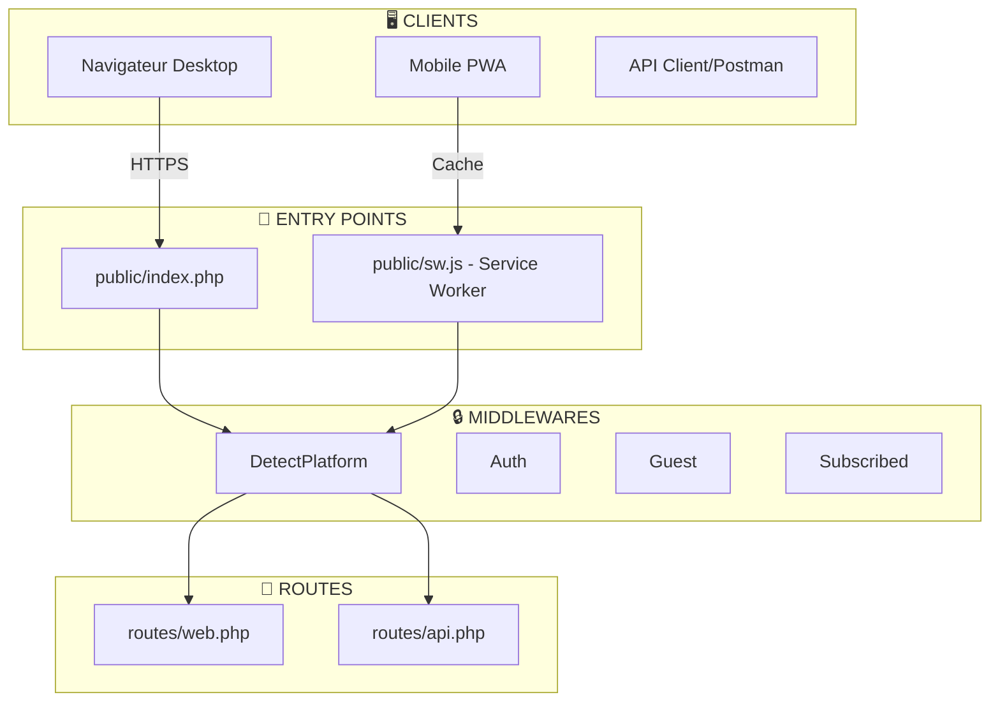

# Prompt pour Claude — Générer le Schéma d'Architecture AgroFinance+ (Exact)

## 🎯 Mission

Analyser **précisément** le schéma d'architecture fourni et reproduire sa **structure exacte** sous forme de **diagramme Mermaid** + description.

---

## 📸 Schéma à reproduire (Description détaillée)

Le schéma affiche une **architecture en 8 couches verticales** avec flux descendant et interconnexions. **REPRODUIRE CETTE STRUCTURE EXACTEMENT** :

### Couche 1 : CLIENTS
- **Boîtes** : « Navigateur Desktop » | « Mobile PWA » | « Client API/Postman »
- **Flux sortant** : HTTPS (vers Entry Points)

### Couche 2 : ENTRY POINTS
- **Boîtes rose/mauve** : 
  - `public/index.php` 
  - `public/sw.js - Service Worker PWA`
- **Flux** : Cache (vers Middlewares)

### Couche 3 : MIDDLEWARES (couleur orange/beige)
- **Boîtes alignées horizontalement** :
  1. `DetectPlatform - global`
  2. `Auth - Authenticateld`
  3. `Guest - LoggedOut/Authenticated`
  4. `Subscribed - VerifyAbonnement`
- Arrow vers Routes

### Couche 4 : ROUTES (couleur bleu clair turquoise)
- **Deux groupes** :
  1. **routes/web.php** :
     - Publiques / contact side portage
     - Invité - connexion inscription OTP PIN
     - Auth - dashboard abonnement
     - [auth+subscribed] - activities transactions rapports
  2. **routes/api.php** :
     - [API publiques] - inscription connexion OTP
     - [API Sanctum] - exploitations activites transactions dashboard
     - [API subscribed] - rapports abonnement seller

### Couche 5 : CONTROLLERS (3 groupes, couleurs distinctes)
- **Auth Web** (rose/magenta) :
  - InscriptionController
  - OtpController
  - PinController
- **Controllers Web** (vert foncé) :
  - DashboardController 161L
  - ActiviteController
  - TransactionController 317L
  - SupportController 211L
  - [autres] RapportController, PagesPubliqueController
- **Controllers API** (vert clair) :
  - DashboardController
  - TransactionController 194L
  - AbonnementController 244L
  - ActiviteController
  - IndicatorsController
  - [Trail Handler/Pdf Abonnement]

### Couche 6 : SERVICES (couleur orange/jaune)
- **Éléments** :
  - AbonnementService 225L + plans quotas FedaPay
  - FinancialIndicators 177L + PB CV CF CT CI VAB MB RNE RF SR
  - Rapports 89L + SMS Vonage
  - ExploitationCategorieSuggestionService
  - HelperTransactionCategories (jaune/or)
  - HelperWeeklyBackgroundImages (jaune/or)

### Couche 7 : MODELS (couleur rouge/terracotta pour domaine + bleu pour système)
**Domaine Métier** :
- User (PK Pin_script)
- Exploitation (1→N)
- Activite (status: en_cours|termine|abandonne)
- Transaction (FK user_id, nature fixe/variable, justificatif photo)
- Abonnement (plan: gratuit/essentielle/pro/cooperative, lien_token PDF)

**Module Aide** :
- HelpCategory FULLTEXT
- HelpArticle thumbnail

**Système** (bleu) :
- ExploitationCategorieSuggestion
- sessions / access_tokens Sanctum
- cache

### Couche 8a : VIEW BLADE / LAYOUTS (couleur bleu)
- **Layouts** : app-desktop glass, app-mobile-1-bottom-nav-public, app-public-share-portage
- **Vues** : [App] dashboard App, [Auth] connexion, [Rapports] index liste
- **Vues Modales** : tous formats
- [Imports] :

### Couche 8b : BASE DE DONNÉES (couleur vert foncé)
- **Boîte gauche** : 
  - MySQL/MariaDB
  - 21 migrations PRODUCTION
- **Boîte centre** : SQLite - Tests

### Couche 9 : SERVICES EXTERNES (couleur orange/rouge)
- **FedaPay** : Paiement SMS pour S3 apps
- **Orange SMS** : OTP SMS Composer
- **Unsplash** : Image auth

---

## 🔧 Output attendu

### Format 1 : Diagramme Mermaid
Générer un **diagramme Mermaid** qui reproduit EXACTEMENT cette structure :
- 8-9 niveaux verticaux
- Couleurs **distinctes** par couche (utiliser `style` ou classes)
- **Labels précis** (ex. `DetectPlatform`, `routes/web.php`, `FinancialIndicators`, etc.)
- **Flux** : arrows + labels (ex. `HTTPS`, `Cache`, etc.)
- **Imbrication** : groupes (subgraph) pour Services, Controllers, Models

**Critère de succès** : Le schéma ressemble **visuellement** à l'image fournie, même structure, même organisation couches.

### Format 2 : Description textuelle
- **1 tableau** : correspondance des couches + examples de composants
- **3-5 paragraphes** : explication du flux général (client → controller → service → model → BDD)
- **Points clés** :
  - Rôle `DetectPlatform` (mobile vs desktop routing)
  - Rôle `Subscribed` middleware (gate abonnement)
  - Sanctum auth vs web sessions
  - Services externes (FedaPay, SMS)
  - Offline sync (IndexedDB + POST /api/v1)

### Format 3 (bonus) : Code détaillé
- Lister le chemin complet pour **1 flux clé** (ex. création transaction) :
  - Quelle route ?
  - Quel controller ?
  - Quel service ?
  - Quel model ?
  - Quel endpoint API ?

---

## 📌 Contraintes strictes

1. **Ne pas inventer** : Utiliser UNIQUEMENT les noms, chemins et couches visibles dans l'image
2. **Respecter l'ordre** : Clients → Entry Points → Middlewares → Routes → Controllers → Services → Models → Views → BDD → Externos
3. **Couleurs** : Rose (Auth), Vert (Web), Bleu (Art/API), Orange (Services), Terracotta (Models), etc.
4. **Exactitude** : Numéros de lignes (ex. `DashboardController 161L`) si présents dans l'image
5. **Terminologie** : Utiliser termes Laravel exacts (`Sanctum`, `middleware`, `subgraph`, etc.)

---

## 🎨 Préférence format Mermaid

### Exemple Mermaid (structure de base)

**ℹ️ IMPORTANT** : Ce diagramme est une **BASE MINIMALISTE**. Claude doit l'**étendre complètement** pour inclure :
- **Controllers Web** (Auth, Dashboard, Activites, Transactions, Rapports, Coopérative)
- **Controllers API** (avec endpoints distincts)
- **Services** (FinancialIndicators, Abonnement, OTP, Rapport, Coopérative, Dashboard)
- **Models** (User, Exploitation, Activite, Transaction, Abonnement, Rapport, CooperativeMember, Help*, ExploitationCategorieSuggestion)
- **Views/Layouts** (app-desktop, app-mobile, authentifié, public)
- **Base de données** (MySQL/MariaDB + migrations)
- **Services externes** (FedaPay, SMS Africa's Talking/Vonage, Unsplash)

**Adapter complètement la structure pour exactement refléter l'image fournie.**

---

## ✅ Checklist Claude

- [ ] Diagramme Mermaid généré (structure 8-9 couches respect)
- [ ] Couleurs appliquées par couche
- [ ] Tous les labels visibles dans l'image inclus
- [ ] Descriptions textuelle claire (flux, auth, abonnement, BDD, externals)
- [ ] Table des couches générée
- [ ] 1 flux complet tracé (optionnel, mais appréciable)
- [ ] Pas d'invention : seulement ce qui est lisible dans l'image
