# 🔍 AUDIT CODE SOURCE

## Projet : AgroFinance+

> Application de gestion financière agricole pour exploitants du Bénin / Afrique de l'Ouest.
> PWA mobile-first avec interface desktop, calculs d'indicateurs financiers agricoles, gestion d'abonnements et génération de rapports PDF.

---

## 1. Langage, Framework et Stack Technique

| Composant | Technologie | Version |
|-----------|-------------|---------|
| **Langage backend** | PHP | ≥ 8.2 |
| **Framework backend** | Laravel | 11.x |
| **Base de données** | MySQL / MariaDB (production) — SQLite (tests) | — |
| **Authentification API** | Laravel Sanctum | ^4.3 |
| **Génération PDF** | barryvdh/laravel-dompdf | ^3.1 |
| **Paiement** | FedaPay (SDK PHP) | ^0.4.7 |
| **SMS OTP** | Vonage (intégré directement, pas de package Composer) | — |
| **Frontend - Build** | Vite | ^5.0 |
| **Frontend - CSS** | TailwindCSS | ^4.2.2 (via plugin Vite) |
| **Frontend - JS** | Alpine.js | ^3.15.8 |
| **Frontend - HTTP** | Axios | ^1.6.4 |
| **Dev tools** | Laravel Pint (formatter), PHPUnit ^10.5, Mockery, Ignition, Laravel Sail | — |

---

## 2. Cartographie de l'Arborescence

```
Agrofinance/
├── app/
│   ├── Console/Commands/          # 2 commandes Artisan custom (seeders centre d'aide)
│   ├── Helpers/
│   │   └── TransactionCategories.php   # Mapping catégories de transactions par type d'exploitation
│   ├── Http/
│   │   ├── Controllers/
│   │   │   ├── Api/               # 7 contrôleurs API + sous-dossier Auth/ (5 fichiers)
│   │   │   ├── Web/               # 9 contrôleurs Web + sous-dossier Auth/ (4 fichiers)
│   │   │   ├── Concerns/          # Traits partagés (HandlesPdfAbonnement)
│   │   │   └── Controller.php     # Contrôleur de base (vide)
│   │   └── Middleware/            # 4 middlewares custom
│   ├── Models/                    # 10 modèles Eloquent
│   ├── Providers/                 # Providers Laravel (par défaut)
│   ├── Services/                  # 4 services métier
│   └── Support/
│       └── WeeklyBackgroundImages.php  # Rotation hebdomadaire de fonds d'écran
├── bootstrap/
│   └── app.php                    # Config middleware, exception handlers API
├── config/                        # 11 fichiers de configuration
├── database/
│   ├── migrations/                # 21 migrations
│   ├── seeders/                   # DatabaseSeeder, HelpCenterSeeder, Support/
│   └── factories/                 # (non exploré, probablement vide ou minimal)
├── docs/                          # Documentation (non exploré)
├── public/
│   ├── manifest.json              # PWA manifest
│   ├── sw.js                      # Service Worker PWA
│   └── images/                    # Images statiques
├── resources/
│   ├── css/app.css                # Styles TailwindCSS
│   ├── js/app.js                  # Scripts Alpine.js/Axios
│   └── views/                     # 13 dossiers de vues Blade + welcome.blade.php
│       ├── layouts/               # app-desktop, app-mobile, app-public, app-auth
│       ├── auth/                  # Connexion, inscription, OTP, PIN
│       ├── dashboard/             # Tableau de bord
│       ├── exploitations/         # CRUD exploitations
│       ├── activites/             # CRUD activités/campagnes
│       ├── transactions/          # CRUD transactions
│       ├── rapports/              # Rapports + templates PDF
│       ├── abonnement/            # Gestion abonnements
│       ├── profil/                # Profil utilisateur
│       ├── parametres/            # Paramètres
│       ├── public/                # Pages marketing (accueil, à-propos, contact, offline)
│       ├── alertes/               # Vue alertes (non routée)
│       └── components/            # Composants Blade réutilisables
├── routes/
│   ├── web.php                    # 99 lignes — Routes Web avec middlewares auth + subscribed
│   ├── api.php                    # 80 lignes — Routes API Sanctum
│   └── console.php                # Routes console
├── tests/
│   ├── Feature/
│   │   ├── Sprint5Test.php        # 6 tests fonctionnels (rapports, abonnement mock)
│   │   ├── ExampleTest.php        # Test par défaut Laravel
│   │   └── Auth/                  # Tests auth (non exploré en détail)
│   └── Unit/
│       ├── UserModelTest.php      # Tests unitaires modèle User
│       └── ExampleTest.php        # Test par défaut
├── LOGIQUE_METIER.md              # Documentation règles métier
├── LOGIQUE_FONCTIONNALITE.md      # Documentation fonctionnalités
├── AGENTS.md                      # Préférences et contexte du workspace
├── sprint2.md / sprint3.md        # Notes de sprints
└── README.md                      # README Laravel par défaut (non personnalisé)
```

---

## 3. Fichiers de Configuration

| Fichier | Rôle | Observation |
|---------|------|-------------|
| [.env.example](file:///c:/Users/hp/Documents/GitHub/Agrofinance/.env.example) | Template variables d'environnement | ✅ Complet, inclut FedaPay, session DB |
| [composer.json](file:///c:/Users/hp/Documents/GitHub/Agrofinance/composer.json) | Dépendances PHP | ✅ 5 require + 7 require-dev |
| [package.json](file:///c:/Users/hp/Documents/GitHub/Agrofinance/package.json) | Dépendances frontend | ✅ Vite, TailwindCSS 4, Alpine.js |
| [vite.config.js](file:///c:/Users/hp/Documents/GitHub/Agrofinance/vite.config.js) | Configuration build frontend | ✅ Minimal, plugin laravel + tailwind |
| [tailwind.config.js](file:///c:/Users/hp/Documents/GitHub/Agrofinance/tailwind.config.js) | Configuration TailwindCSS | Présent |
| [phpunit.xml](file:///c:/Users/hp/Documents/GitHub/Agrofinance/phpunit.xml) | Configuration tests | Présent |
| [config/database.php](file:///c:/Users/hp/Documents/GitHub/Agrofinance/config/database.php) | Config BDD | ✅ MySQL/MariaDB/SQLite, collation alignée |
| [config/services.php](file:///c:/Users/hp/Documents/GitHub/Agrofinance/config/services.php) | Services tiers | ✅ FedaPay avec mock, Postmark, SES |
| [config/session.php](file:///c:/Users/hp/Documents/GitHub/Agrofinance/config/session.php) | Sessions | Driver `database` |
| [config/cache.php](file:///c:/Users/hp/Documents/GitHub/Agrofinance/config/cache.php) | Cache | Driver `database` |
| [config/queue.php](file:///c:/Users/hp/Documents/GitHub/Agrofinance/config/queue.php) | Files d'attente | Driver `database` |
| [config/dompdf.php](file:///c:/Users/hp/Documents/GitHub/Agrofinance/config/dompdf.php) | Config PDF | Présent (12KB, complet) |
| [.gitignore](file:///c:/Users/hp/Documents/GitHub/Agrofinance/.gitignore) | Exclusions Git | ✅ Inclut `.env`, `*.sql`, `.cursor/`, vendor, etc. |
| [public/manifest.json](file:///c:/Users/hp/Documents/GitHub/Agrofinance/public/manifest.json) | PWA manifest | ✅ Shortcuts, icônes 72-512px |
| [public/sw.js](file:///c:/Users/hp/Documents/GitHub/Agrofinance/public/sw.js) | Service Worker PWA | ✅ Cache First/Network First/Stale-While-Revalidate |

---

## 4. Dépendances Externes et Versions

### Backend (Composer)

| Package | Version | Usage |
|---------|---------|-------|
| `laravel/framework` | ^11.0 | Framework principal |
| `laravel/sanctum` | ^4.3 | Authentification API par tokens |
| `barryvdh/laravel-dompdf` | ^3.1 | Génération de rapports PDF |
| `fedapay/fedapay-php` | ^0.4.7 | Paiement mobile money (FedaPay) |
| `laravel/tinker` | ^2.9 | Console interactive |

> ⚠️ **Vonage** (SMS OTP) est utilisé dans [OtpService.php](file:///c:/Users/hp/Documents/GitHub/Agrofinance/app/Services/OtpService.php) mais **n'est pas déclaré dans [composer.json](file:///c:/Users/hp/Documents/GitHub/Agrofinance/composer.json)**. L'autoload fonctionne uniquement si installé globalement ou si le package est dans le vendor sans être déclaré.

### Frontend (npm)

| Package | Version | Usage |
|---------|---------|-------|
| [vite](file:///c:/Users/hp/Documents/GitHub/Agrofinance/app/Models/Activite.php#7-75) | ^5.0 | Build tool |
| `laravel-vite-plugin` | ^1.0 | Intégration Laravel/Vite |
| `tailwindcss` | ^4.2.2 | Framework CSS |
| `@tailwindcss/vite` | ^4.2.2 | Plugin Vite pour TailwindCSS |
| `axios` | ^1.6.4 | Client HTTP |
| `alpinejs` | ^3.15.8 | JS interactif léger |

---

## 5. Points d'Entrée de l'Application

### Points d'entrée HTTP

| Type | Fichier | Description |
|------|---------|-------------|
| **Web** | [routes/web.php](file:///c:/Users/hp/Documents/GitHub/Agrofinance/routes/web.php) | 99 lignes — Page d'accueil, auth (guest), modules auth+subscribed, pages publiques (aide, marketing), partage rapports |
| **API** | [routes/api.php](file:///c:/Users/hp/Documents/GitHub/Agrofinance/routes/api.php) | 80 lignes — Auth publique, routes Sanctum sans/avec abonnement, callback FedaPay |
| **Artisan** | [routes/console.php](file:///c:/Users/hp/Documents/GitHub/Agrofinance/routes/console.php) | Commandes console (minimal) |
| **Health** | `/up` | Health check Laravel (configuré dans [bootstrap/app.php](file:///c:/Users/hp/Documents/GitHub/Agrofinance/bootstrap/app.php)) |
| **PWA** | [public/sw.js](file:///c:/Users/hp/Documents/GitHub/Agrofinance/public/sw.js) | Service Worker interceptant requêtes réseau |
| **Index** | [public/index.php](file:///c:/Users/hp/Documents/GitHub/Agrofinance/public/index.php) | Point d'entrée PHP standard Laravel |

### Flux d'authentification

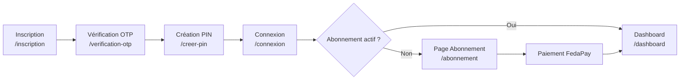

### Architecture des middlewares

| Middleware | Alias | Rôle |
|-----------|-------|------|
| [Authenticate](file:///c:/Users/hp/Documents/GitHub/Agrofinance/app/Http/Middleware/Authenticate.php#8-19) | `auth` | Vérification authentification, redirection vers `/connexion` |
| `RedirectIfAuthenticated` | `guest` | Redirection des users déjà connectés |
| [VerifierAbonnement](file:///c:/Users/hp/Documents/GitHub/Agrofinance/app/Http/Middleware/VerifierAbonnement.php#10-63) | `subscribed` | Bloque les modules métier si abonnement expiré (403 API / redirect web) |
| [DetectPlatform](file:///c:/Users/hp/Documents/GitHub/Agrofinance/app/Http/Middleware/DetectPlatform.php#19-66) | *(web global)* | Détecte mobile/desktop via User-Agent, partage `$layout` / `$platform` |

---

## 6. Architecture Générale du Projet

### Pattern Architectural : MVC avec couche Services

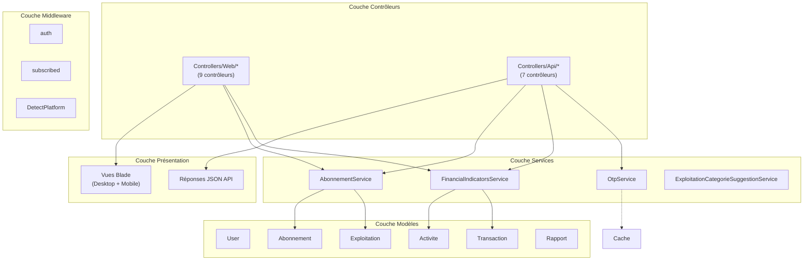

### Modèle de données

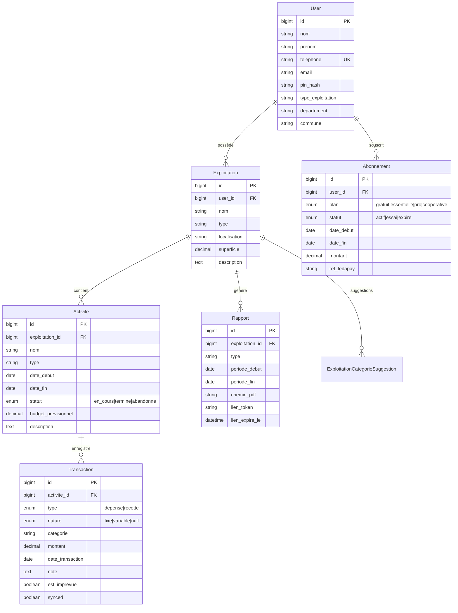

### Modules Fonctionnels

| Module | API | Web | Description |
|--------|-----|-----|-------------|
| **Authentification** | ✅ 5 routes | ✅ 4 contrôleurs | Inscription → OTP → PIN → Connexion par téléphone |
| **Exploitations** | ✅ CRUD | ✅ Create+Store | Gestion des exploitations agricoles |
| **Activités/Campagnes** | ✅ CRUD + clôture/abandon | ✅ CRUD + clôture/abandon | Campagnes agricoles avec budget prévisionnel |
| **Transactions** | ✅ CRUD batch | ✅ CRUD unitaire | Dépenses/Recettes avec catégorisation par type d'exploitation |
| **Indicateurs financiers** | ✅ 3 routes | *(via Dashboard)* | PB, CV, CF, CT, CI, VAB, MB, RNE, RF, SR |
| **Dashboard** | ✅ Consolidation | ✅ Vue complète | Consolidation par exploitation, alertes budget |
| **Rapports PDF** | ✅ Générer + Télécharger | ✅ Générer + Télécharger | Campagne, dossier crédit, partage public |
| **Abonnement** | ✅ Initier + Mock + Callback | ✅ Index + Initier + Mock + Callback | Gratuit, Essentielle, Pro, Coopérative |
| **Centre d'aide** | ❌ | ✅ Index + Recherche + Articles | Articles hiérarchisés par catégorie |
| **Pages marketing** | ❌ | ✅ Accueil, À propos, Contact | Layout public dédié |
| **Profil** | ❌ | ✅ Index + Update | Profil utilisateur |
| **PWA / Offline** | ❌ | ✅ Service Worker | Cache First + Network First + Stale-While-Revalidate |

### Logique Métier Clé

- **Authentification** : Par numéro de téléphone + code PIN ([getAuthIdentifierName() = 'telephone'](file:///c:/Users/hp/Documents/GitHub/Agrofinance/app/Models/User.php#22-31)). Attention : `Auth::id()` renvoie le téléphone, pas l'ID numérique.
- **Abonnement** : 4 plans (Gratuit 0 FCFA / Essentielle 1 500 / Pro 5 000 / Coopérative 8 000). Quotas d'exploitations (1/1/5/∞). Historique limité à 6 mois pour le plan gratuit.
- **Indicateurs financiers agricoles** : Calcul en mémoire (pas de vues SQL) des indicateurs PB, CV, CF, CT, CI, VAB, MB, RNE, RF, SR.
- **Alertes budget** : Notifications à 70%, 90%, 100% du budget prévisionnel consommé.
- **Sécurité ownership** : Chaque requête vérifie que la ressource appartient à l'utilisateur via `whereHas('...', fn($q) => $q->where('user_id', auth()->user()->id))`.

---

## 7. Résumé de la Stack

| Caractéristique | Détail |
|-----------------|--------|
| **Type d'application** | Application web full-stack + API REST + PWA |
| **Architecture** | MVC Laravel classique avec couche Services |
| **Cible** | Exploitants agricoles francophones (Bénin) |
| **Dual-rendering** | Desktop (sidebar glassmorphisme) / Mobile (bottom dock, dark mode) |
| **Monnaie** | FCFA (XOF) |
| **Auth** | Téléphone + PIN (pas email/password classique) |
| **Paiement** | FedaPay (mobile money) avec mode mock pour le dev |
| **Taille du projet** | ~25 fichiers PHP critiques, ~4 500 lignes de code applicatif |
| **Maturité** | Sprint 5+ en cours, projet fonctionnel avec lacunes de tests et documentation |

---

## Vue d'ensemble

L'architecture du projet suit le pattern **MVC de Laravel** enrichi d'une **couche Services**. Dans l'ensemble, la structure est solide pour un projet en phase de démarrage (sprint 5), mais présente plusieurs points de fragilité qui méritent d'être adressés avant la montée en charge ou l'ajout de nouvelles fonctionnalités.

---

## 2.1.1 — Respect des patterns architecturaux (MVC + Services)

### 🟢 Ce qui est bien fait

Le projet suit correctement le pattern **MVC + couche Services** de Laravel :

- **Modèles** (`app/Models/`) → Définissent les entités métier, les relations Eloquent (hasMany, belongsTo) et les constantes d'état (`STATUT_EN_COURS`, `STATUT_TERMINE`, `STATUT_ABANDONNE`).
- **Contrôleurs** (`app/Http/Controllers/Api/` et `Web/`) → S'occupent de recevoir les requêtes, déléguer aux services, et retourner une réponse (JSON ou vue Blade).
- **Services** (`app/Services/`) → Concentrent la logique métier réutilisable (calculs FSA, gestion abonnements, OTP, suggestions catégories).
- **Vues** (`resources/views/`) → Bien organisées par module, avec layouts partagés.
- **Middlewares** → Correctement utilisés pour l'authentification et le contrôle d'abonnement.

La séparation entre **contrôleurs API** et **contrôleurs Web** est une excellente décision architecturale : les 7 contrôleurs API retournent du JSON, les 9 contrôleurs Web retournent des vues Blade. Cela rend le code explicite et facilite la maintenance.

---

### 🟠 Point 1 : Duplication de logique entre contrôleurs API et Web

**Niveau : 🟠 Majeur**

La logique de génération de rapport PDF est **dupliquée presque à l'identique** entre :
- `app/Http/Controllers/Api/RapportController.php` (lignes 86–121)
- `app/Http/Controllers/Web/RapportController.php` (lignes 85–122)

Les deux méthodes `generer()` font exactement les mêmes opérations : validation, vérification ownership, calcul indicateurs, chargement transactions, création token, instanciation DomPDF, sauvegarde Storage, mise à jour `chemin_pdf`. Seule la réponse finale diffère (JSON vs redirect).

**Exemple — API** (`Api/RapportController@generer`, lignes 80–134) :
```php
$indicateurs = $this->indicateurs->calculer($activite->id, $request->periode_debut, $request->periode_fin);
$transactions = $activite->transactions()->whereBetween('date_transaction', ...)->orderBy('date_transaction')->get();
$token = Str::random(40);
$rapport = Rapport::create([...]);
$pdf = Pdf::loadView($template, compact(...));
Storage::disk('local')->makeDirectory('rapports');
Storage::disk('local')->put($chemin, $pdf->output());
$rapport->update(['chemin_pdf' => $chemin]);
```

**Exemple — Web** (`Web/RapportController@generer`, lignes 85–119) :
```php
// Code presque identique, copié-collé
$indicateurs = $this->fsa->calculer($activite->id, $debut, $fin);
$transactions = $activite->transactions()->whereBetween('date_transaction', ...)->orderBy('date_transaction')->get();
$token = Str::random(40);
$rapport = Rapport::create([...]);
$pdf = Pdf::loadView($template, compact(...));
Storage::disk('local')->makeDirectory('rapports');
Storage::disk('local')->put($chemin, $pdf->output());
$rapport->update(['chemin_pdf' => $chemin]);
```

**Impact** : Si un bug est trouvé dans la logique de génération (ex. mauvais format de date, problème de stockage), il doit être corrigé **à deux endroits**. Risque de dérive entre les deux implémentations.

**Correction recommandée** : Extraire la logique commune dans un service `RapportService` ou dans le trait `HandlesPdfAbonnement` (déjà existant) :

```php
// app/Services/RapportService.php
class RapportService
{
    public function generer(User $user, Activite $activite, string $type, string $debut, string $fin): Rapport
    {
        // Logique unique de génération PDF
        $token = Str::random(40);
        $rapport = Rapport::create([...]);
        $pdf = Pdf::loadView($template, [...]);
        Storage::disk('local')->put($chemin, $pdf->output());
        $rapport->update(['chemin_pdf' => $chemin]);
        return $rapport;
    }
}
```

**Effort** : Moyen (2-4h)

---

### 🟠 Point 2 : Validation des entrées API différente entre Web et API

**Niveau : 🟠 Majeur**

La méthode `generer()` du `Web/RapportController` accepte `periode_debut` et `periode_fin` comme **nullables** (lignes 58–59) tandis que la version API les exige comme **required** (lignes 53–54 de `Api/RapportController`). Ces deux comportements divergents pour la même opération métier sont un risque de régression :

```php
// Web/RapportController (ligne 58) → nullable
'periode_debut' => 'nullable|date',
'periode_fin'   => 'nullable|date|after_or_equal:periode_debut',

// Api/RapportController (ligne 53) → required
'periode_debut' => 'required|date',
'periode_fin'   => 'required|date|after_or_equal:periode_debut',
```

**Impact** : La Web UI peut générer un rapport sans période et utilise des valeurs par défaut (date_debut campagne ou début de mois), ce qui peut surprendre les utilisateurs API qui croient que le comportement est identique.

**Correction** : Unifier dans un `RapportService` avec des valeurs par défaut explicites et documentées.

**Effort** : Faible (1h)

---

## 2.1.2 — Séparation des Responsabilités (SRP)

### 🟠 Point 3 : DashboardController Web trop volumineux

**Niveau : 🟠 Majeur**

Le `Web/DashboardController::index()` fait **161 lignes** et orchestre en une seule méthode :
1. Récupération de l'exploitation (ligne 26)
2. Calcul des indicateurs financiers (ligne 37)
3. Sélection de l'activité "hero" (lignes 51–66)
4. Construction des cartes d'activités avec calcul en mémoire (lignes 70–109)
5. Calcul du pourcentage budget par activité (lignes 90–94)
6. Filtrage et tri des alertes budget (lignes 114–122)
7. Récupération des dernières transactions (lignes 124–131)
8. Récupération du token API depuis la session (ligne 133)
9. Informations abonnement (ligne 134)
10. Passage de 15 variables à la vue (lignes 136–158)

C'est une violation flagrante du **Single Responsibility Principle**. Une méthode de contrôleur ne doit orchestrer l'affichage, elle ne devrait pas contenir de logique de calcul (lignes 85–94) :

```php
// Lignes 90–94 — Calcul métier dans le contrôleur (à déplacer dans le service)
$totalDep = $txForStats->where('type', 'depense')->sum('montant');
$budget = $activite->budget_previsionnel;
$pctBudget = ($budget && $budget > 0)
    ? min(100, round(($totalDep / $budget) * 100, 1))
    : null;
```

Ce calcul de pourcentage de budget est **identique à la logique qui existe déjà** dans `Activite::alerteBudget()` (modèle `Activite.php`, lignes 44–73). Le contrôleur réinvente la roue au lieu de déléguer.

**Impact** : Le contrôleur devient un "God Object" difficile à tester, à lire et à faire évoluer. Un changement dans le modèle de données de l'activité nécessite de modifier plusieurs endroits.

**Correction recommandée** :
```php
// Extraire dans FinancialIndicatorsService ou un DashboardPresenter/DTO
class DashboardService
{
    public function buildActiviteCards(Collection $activites, ?string $dateFloor): array
    {
        // Logique actuellement dans DashboardController lignes 70-109
    }
}
```

**Effort** : Moyen (3-5h)

---

### 🟡 Point 4 : Modèle Activite avec logique métier

**Niveau : 🟡 Mineur (acceptable, mais à surveiller)**

La méthode `Activite::alerteBudget()` (lignes 44–73) effectue une **requête SQL** depuis le modèle. C'est un pattern "Fat Model" qui peut être acceptable dans Laravel, mais qui peut devenir problématique si la logique s'étoffe :

```php
// Activite.php ligne 50 — requête SQL dans le modèle
$q = $this->transactions()->where('type', 'depense');
if ($dateTransactionMin) {
    $q->where('date_transaction', '>=', $dateTransactionMin);
}
$totalDepenses = $q->sum('montant');
```

**Impact actuel** : Faible. Le pattern reste lisible et cette méthode est réutilisée correctement (dans `ActiviteController@show` et `DashboardController` API).

**Recommandation** : À terme, migrer vers `FinancialIndicatorsService` si cette logique grossit.

---

## 2.1.3 — Niveau de couplage entre modules

### 🟠 Point 5 : AbonnementService injecté dans trop de contrôleurs

**Niveau : 🟠 Majeur**

`AbonnementService` est injecté dans **6 contrôleurs différents** (TransactionController API+Web, DashboardController API+Web, RapportController API+Web, ActiviteController API). C'est un signe de **couplage fort** entre les modules fonctionnels et la couche d'abonnement.

Si les règles d'abonnement changent (ex. ajout d'un quota de transactions par mois), il faudra potentiellement modifier chaque contrôleur. La logique de vérification des quotas devrait être **centralisée**.

```
AbonnementService → injecté dans :
├── Api/TransactionController
├── Web/TransactionController  
├── Api/DashboardController
├── Web/DashboardController
├── Api/RapportController
└── Web/RapportController
└── Api/ActiviteController (indirectement via dateDebutHistorique)
```

**Impact** : Couplage impactant la maintenabilité. Tout changement de l'API publique d'`AbonnementService` se propage à 6+ fichiers.

**Correction** : Encapsuler les vérifications de quotas dans un middleware dédié par type d'action, ou centraliser dans un `PolicyService` :

```php
// Option : Gate/Policy Laravel pour décentraliser les vérifications
Gate::define('generer-rapport', function (User $user) {
    return app(AbonnementService::class)->peutGenererPDF($user);
});

// Dans le contrôleur :
$this->authorize('generer-rapport');
```

**Effort** : Moyen (4-6h)

---

### 🟡 Point 6 : Ownership check répété sans abstraction

**Niveau : 🟡 Mineur**

La vérification d'appartenance d'une ressource à l'utilisateur authentifié est **répétée à l'identique** dans tous les contrôleurs, plusieurs dizaines de fois dans le projet :

```php
// Répété dans TOUS les contrôleurs (Api et Web) :
Transaction::whereHas('activite.exploitation', function ($q) {
    $q->where('user_id', auth()->user()->id);
})->findOrFail($id);

// Variante dans ActiviteController :
Activite::whereHas('exploitation', function ($q) {
    $q->where('user_id', auth()->user()->id);
})->findOrFail($id);
```

On compte au moins **15 occurrences** de ce pattern dans le code.

**Impact** : Si la structure de la relation change (ex. ajout d'une équipe/organisation), toutes ces requêtes doivent être mises à jour manuellement.

**Correction recommandée** : Utiliser des **Eloquent Scopes** ou des **Policy Laravel** :

```php
// Dans Transaction.php :
public function scopePourUtilisateur(Builder $query, int $userId): Builder
{
    return $query->whereHas('activite.exploitation', fn($q) => $q->where('user_id', $userId));
}

// Usage dans le contrôleur — DRY :
Transaction::pourUtilisateur(auth()->user()->id)->findOrFail($id);
```

**Effort** : Moyen (2-4h, refactoring progressif possible)

---

## 2.1.4 — Cohérence et Modularité Globale

### 🟢 Ce qui est bien fait

- **Nomenclature française cohérente** : Les noms de routes, méthodes, variables et messages sont tous en français, ce qui est cohérent avec le contexte métier.
- **Constantes d'état dans le modèle** : `Activite::STATUT_EN_COURS`, `STATUT_TERMINE`, `STATUT_ABANDONNE` évitent les "magic strings" partout.
- **Trait `HandlesPdfAbonnement`** : Bonne idée de factorisation pour la vérification PDF partagée entre API et Web `RapportController`.
- **`TransactionCategories` helper** : Centralise la liste des catégories par type d'exploitation — bon reflex de centralisation.
- **`ExploitationCategorieSuggestionService`** : Service bien isolé avec une responsabilité claire (apprendre les catégories custom des utilisateurs).
- **Séparation `Api/` vs `Web/`** dans les contrôleurs : décision architecturale excellente.

---

### 🟡 Point 7 : La vue `alertes/index.blade.php` existe mais n'est pas routée

**Niveau : 🟡 Mineur**

La vue `resources/views/alertes/index.blade.php` existe dans l'arborescence mais **aucune route** ne pointe vers elle dans `routes/web.php`. Le module "alertes" est donc une coquille vide. La règle dans AGENTS.md utilise `abonnement` comme fallback pour la cloche de notification mobile, ce qui confirme que le module n'est pas finalisé.

**Impact** : Confusion potentielle pour les développeurs qui cherchent à implémenter les alertes. Code mort dans les vues.

**Correction** : Soit implémenter le module complet, soit supprimer la vue jusqu'à son implémentation.

**Effort** : Faible (décision + 30 min de nettoyage)

---

### 🟡 Point 8 : Pas de Repository Pattern — acceptable mais à surveiller

**Niveau : 🟡 Mineur (acceptable pour la taille actuelle)**

Le projet utilise directement Eloquent dans les contrôleurs et services sans couche Repository. C'est standard dans Laravel et tout à fait acceptable pour un projet de cette taille. Cependant, plusieurs contrôleurs font des requêtes Eloquent assez complexes directement :

```php
// Web/DashboardController.php ligne 26-28
$exploitation = Exploitation::where('user_id', $uid)
    ->with(['activitesActives' => fn ($q) => $q->with('transactions')])
    ->first();
```

**Impact actuel** : Faible. Le couplage direct à Eloquent rend les tests unitaires plus complexes (nécessite une base de données réelle ou des mocks complexes).

**Recommandation pour le long terme** : Si le projet grossit, introduire des Repository selectivement pour les requêtes complexes.

---

## 2.1.5 — Scalabilité de l'Architecture

### 🔴 Point 9 : Architecture mono-exploitation par utilisateur dans la couche Web

**Niveau : 🔴 Critique du point de vue fonctionnel**

Le `Web/DashboardController` ne récupère que **la première exploitation** de l'utilisateur (ligne 26 : `->first()`), alors que le plan Pro permet jusqu'à 5 exploitations et le plan Coopérative un nombre illimité :

```php
// Web/DashboardController.php ligne 26-28 — BUG POTENTIEL
$exploitation = Exploitation::where('user_id', $uid)
    ->with(['activitesActives' => fn ($q) => $q->with('transactions')])
    ->first();  // ← Ne prend QUE la première exploitation !
```

Alors que le contrôleur API `DashboardController` gère correctement **toutes les exploitations** (ligne 28 : `->get()`).

C'est une **divergence fonctionnelle entre l'API et l'interface Web** : un utilisateur Pro avec 3 exploitations ne verra qu'une seule sur l'interface Web, alors que l'API lui retourne les 3.

**Impact** : Les utilisateurs Pro/Coopérative avec plusieurs exploitations ont une interface Web incomplète. Risque de perte de données perçue (transactions visibles en API mais pas en Web).

**Correction** :
```php
// Option 1 : Permettre à l'utilisateur de sélectionner son exploitation (query param)
$exploitationId = $request->query('exploitation_id');
$exploitation = Exploitation::where('user_id', $uid)
    ->when($exploitationId, fn($q) => $q->where('id', $exploitationId), fn($q) => $q->orderBy('id'))
    ->firstOrFail();

// Option 2 : Afficher toutes les exploitations comme l'API
$exploitations = Exploitation::where('user_id', $uid)->with([...])->get();
```

**Effort** : Moyen (4-6h, nécessite adaptation de la vue Blade)

---

### 🟠 Point 10 : Architecture stateful — sessions et fichiers locaux

**Niveau : 🟠 Majeur (scalabilité)**

L'application utilise :
- **Sessions PHP** pour stocker le contexte FedaPay (`fedapay_transaction_id`, `fedapay_plan`, `fedapay_user_id`) — `Api/AbonnementController.php` lignes 103–107.
- **Fichiers PDF locaux** stockés sur le disque local (`Storage::disk('local')`) — ne fonctionnerait pas sur plusieurs serveurs.
- **Token API stocké en session** pour l'interface Web (`session('api_token')` — `Web/DashboardController.php` ligne 133).

```php
// Api/AbonnementController.php lignes 103-107 — SESSION dans une route API !
Session::put([
    'fedapay_transaction_id' => $txId,
    'fedapay_plan'           => $request->plan,
    'fedapay_user_id'        => $user->id,
]);
```

Utiliser des sessions dans les routes API est une **anomalie architecturale** : les APIs REST doivent être **stateless**. Cela fonctionne dans le contexte XAMPP actuel (session `database`), mais empêcherait toute scalabilité horizontale.

**Impact** : Impossible de déployer sur 2+ serveurs ou conteneurs sans partager l'état de session (Redis/DB centralisée). Les PDFs sur disque local ne seraient pas accessibles depuis un 2ème serveur.

**Correction pour la production** :
1. Remplacer `Session::put()` par une entrée en base de données ou Redis pour le contexte FedaPay.
2. Utiliser S3/cloud storage pour les PDFs au lieu du disque local.
3. Configurer `SESSION_DRIVER=redis` si multi-instances.

**Effort** : Élevé (nécessite refactoring + infrastructure)

---

### 🟡 Point 11 : Pas de versioning API

**Niveau : 🟡 Mineur (acceptable phase actuelle)**

Les routes API ne sont pas versionnées (`/api/transactions` au lieu de `/api/v1/transactions`). Si l'API est exposée à des clients mobiles ou tiers, tout changement de contrat API est une **breaking change** silencieuse.

**Correction** :
```php
// routes/api.php
Route::prefix('v1')->group(function () {
    // toutes les routes actuelles
});
```

**Effort** : Faible (1h si fait maintenant, difficile et risqué plus tard)

---

## 📊 Synthèse 2.1 — Architecture & Conception

| Sous-domaine | Niveau | Résumé |
|---|---|---|
| Pattern MVC + Services | 🟢 OK | Bien respecté, séparation API/Web excellente |
| Séparation des responsabilités | 🟠 Majeur | DashboardController trop lourd, duplication RapportController |
| Couplage entre modules | 🟠 Majeur | AbonnementService sur-injecté, ownership check répété |
| Cohérence et modularité | 🟡 Mineur | Vue alertes non routée, constantes bien utilisées |
| Scalabilité | 🔴 Critique | Web mono-exploitation, sessions dans API, fichiers locaux |

**Note globale Architecture : 6.5/10**

> Le socle est bon, le pattern est clair et cohérent. Les faiblesses principales sont la duplication de logique entre contrôleurs API/Web, un DashboardController trop chargé, et des choix architecturaux (sessions en API, fichiers locaux) qui bloquent la scalabilité future.

---
Qualité & Maintenabilité du Code
---
## Vue d'ensemble

La base de code est **globalement lisible et bien intentionnée**. Le nommage est cohérent, français, et les classes ont une taille raisonnable. Les problèmes de qualité identifiés relèvent surtout de la **duplication**, quelques fonctions trop longues, et de **l'absence d'abstraction** pour des patterns répétés. Il n'y a pas de code illisible ou de dette technique catastrophique, mais plusieurs points méritent une attention avant de passer en production.

---

## 2.2.1 — Lisibilité et Clarté du Code (Nommage, Structure)

### 🟢 Ce qui est bien fait

**Nommage cohérent et expressif :**
- Les noms de méthodes sont parlants : [genererEtEnvoyer()](file:///c:/Users/hp/Documents/GitHub/Agrofinance/app/Services/OtpService.php#14-26), [peutGenererPDF()](file:///c:/Users/hp/Documents/GitHub/Agrofinance/app/Services/AbonnementService.php#83-87), `messageLimit eExploitations()`, [dateDebutHistorique()](file:///c:/Users/hp/Documents/GitHub/Agrofinance/app/Services/AbonnementService.php#123-130) — on comprend immédiatement ce que fait chaque méthode.
- Les constantes de statut (`STATUT_EN_COURS`, `STATUT_TERMINE`, `STATUT_ABANDONNE`) dans le modèle [Activite.php](file:///c:/Users/hp/Documents/GitHub/Agrofinance/app/Models/Activite.php) évitent les chaînes magiques ("magic strings") dans tout le code.
- Les clés des tableaux de réponse JSON sont homogènes : `succes`, [message](file:///c:/Users/hp/Documents/GitHub/Agrofinance/app/Services/AbonnementService.php#138-153), `data` dans tous les contrôleurs API — excellent.
- La nomenclature française est appliquée de façon rigoureuse et cohérente dans tout le projet.

**Structure des fichiers :**
- La séparation `Api/` vs `Web/` dans les contrôleurs est très lisible.
- Les services ont des noms explicites : [AbonnementService](file:///c:/Users/hp/Documents/GitHub/Agrofinance/app/Services/AbonnementService.php#10-225), [FinancialIndicatorsService](file:///c:/Users/hp/Documents/GitHub/Agrofinance/app/Services/FinancialIndicatorsService.php#8-172), [OtpService](file:///c:/Users/hp/Documents/GitHub/Agrofinance/app/Services/OtpService.php#8-88), [ExploitationCategorieSuggestionService](file:///c:/Users/hp/Documents/GitHub/Agrofinance/app/Services/ExploitationCategorieSuggestionService.php#9-85).

---

### 🟡 Point 1 : Nommage incohérent entre indicateurs (acronymes vs mots)

**Niveau : 🟡 Mineur**

Dans [FinancialIndicatorsService](file:///c:/Users/hp/Documents/GitHub/Agrofinance/app/Services/FinancialIndicatorsService.php#8-172), les indicateurs financiers sont représentés par des acronymes (`PB`, `CV`, `CF`, `CT`, `CI`, `VAB`, `MB`, `RNE`, `RF`, `SR`) sans aucune constante ni enum pour les définir. Un développeur rejoignant le projet ne sait pas spontanément ce que signifie `RF` (Rentabilité Financière) ou `SR` (Seuil de Rentabilité) sans lire les commentaires métier.

```php
// FinancialIndicatorsService.php lignes 55-66 — acronymes non documentés en code
return [
    'PB'  => round($PB, 2),   // Produit Brut — non expliqué ici
    'CV'  => round($CV, 2),   // Charges Variables
    'CF'  => round($CF, 2),   // Charges Fixes
    'CT'  => round($CT, 2),   // Coût Total
    'CI'  => round($CI, 2),   // Consommations Intermédiaires
    'VAB' => round($VAB, 2),  // Valeur Ajoutée Brute
    'MB'  => round($MB, 2),   // Marge Brute
    'RNE' => round($RNE, 2),  // Résultat Net d'Exploitation
    'RF'  => $RF,             // Rentabilité Financière (%)
    'SR'  => $SR,             // Seuil de Rentabilité
];
```

**Impact** : Courbe d'apprentissage élevée pour les nouveaux développeurs. Risque de confusion entre `CT` (Coût Total) et `CF` (Charges Fixes) quand on lit rapidement.

**Correction recommandée** : Ajouter des constantes de classe ou une enum PHP 8.1+ :

```php
// app/Enums/IndicateurFinancier.php
enum IndicateurFinancier: string
{
    case PRODUIT_BRUT              = 'PB';
    case CHARGES_VARIABLES         = 'CV';
    case CHARGES_FIXES             = 'CF';
    case COUT_TOTAL                = 'CT';
    case CONSOMMATIONS_INTERMEDIAIRES = 'CI';
    case VALEUR_AJOUTEE_BRUTE      = 'VAB';
    case MARGE_BRUTE               = 'MB';
    case RESULTAT_NET_EXPLOITATION = 'RNE';
    case RENTABILITE_FINANCIERE    = 'RF';
    case SEUIL_RENTABILITE         = 'SR';
}
```

**Effort** : Faible (1-2h)

---

### 🟡 Point 2 : Méthode [normaliserTelephone()](file:///c:/Users/hp/Documents/GitHub/Agrofinance/app/Http/Controllers/Web/Auth/InscriptionController.php#60-74) avec logique ambiguë

**Niveau : 🟡 Mineur**

Dans [Web/Auth/InscriptionController.php](file:///c:/Users/hp/Documents/GitHub/Agrofinance/app/Http/Controllers/Web/Auth/InscriptionController.php), la méthode [normaliserTelephone()](file:///c:/Users/hp/Documents/GitHub/Agrofinance/app/Http/Controllers/Web/Auth/InscriptionController.php#60-74) (lignes 60–73) a un cas par défaut silencieux qui peut créer des numéros invalides :

```php
// InscriptionController.php lignes 60-73
private function normaliserTelephone(string $telephone): string
{
    $digits = preg_replace('/\D/', '', $telephone);

    if (str_starts_with($digits, '229') && strlen($digits) >= 11) {
        return '+'.$digits;
    }
    if (strlen($digits) === 8) {
        return '+229'.$digits;
    }
    // ⚠️ Cas ambigu : un numéro comme "0612345678" (10 chiffres, sans 229)
    // retournera "+0612345678" → numéro invalide silencieusement
    return str_starts_with($telephone, '+') ? '+'.$digits : '+'.$digits;
}
```

La dernière ligne (`return str_starts_with($telephone, '+') ? '+'.$digits : '+'.$digits`) est **identique dans les deux branches** du ternaire — elle n'a donc aucun effet et est une erreur logique.

**Impact** : Un numéro international hors format béninois (+33612345678 par ex.) sera mal formaté silencieusement, sans erreur. Le validateur regex (`+229\d{8}`) le rejettera heureusement en aval, mais la méthode de normalisation est confuse.

**Correction** :
```php
private function normaliserTelephone(string $telephone): string
{
    $digits = preg_replace('/\D/', '', $telephone);

    if (str_starts_with($digits, '229') && strlen($digits) >= 11) {
        return '+'.$digits;
    }
    if (strlen($digits) === 8) {
        return '+229'.$digits;
    }
    // Retourner tel quel avec + pour que le validateur regex rejette proprement
    return '+'.$digits;
}
```

**Effort** : Faible (15 minutes)

---

## 2.2.2 — Complexité Cyclomatique (Fonctions trop longues/complexes)

### 🟠 Point 3 : `AbonnementService::activer()` — logique conditionnelle imbriquée

**Niveau : 🟠 Majeur**

La méthode [activer()](file:///c:/Users/hp/Documents/GitHub/Agrofinance/app/Services/AbonnementService.php#181-224) dans [AbonnementService.php](file:///c:/Users/hp/Documents/GitHub/Agrofinance/app/Services/AbonnementService.php) (lignes 185–223) contient une chaîne de conditions `if/elseif` pour calculer la durée d'abonnement qui est redondante et fragile :

```php
// AbonnementService.php lignes 197-212
if ($plan === 'annuel') {
    $dureeJours = 30;         // ← 'annuel' mais seulement 30 jours ?
} elseif ($plan === 'cooperative') {
    $dureeJours = 30;         // ← même valeur que annuel
} elseif ($plan === 'mensuel') {
    $dureeJours = 30;         // ← encore la même valeur !
} elseif (in_array($plan, ['essai', 'gratuit'], true)) {
    $dureeJours = 75;
} else {
    $dureeJours = match ($planDb) {  // ← second switch dans le else !
        'gratuit' => 75,
        'pro', 'cooperative', 'essentielle' => 30,
        default => 30,
    };
}
```

**Trois problèmes ici :**
1. `mensuel`, `annuel` et `cooperative` ont **tous la même valeur de 30 jours** — les 3 premières branches `if/elseif` sont donc identiques et pourraient être regroupées.
2. L'abonnement `annuel` donne 30 jours comme le mensuel — est-ce volontaire ou un bug ? Un abonnement "annuel" ne devrait-il pas donner 365 jours ?
3. Le bloc `else` avec un `match` à l'intérieur est une complexité inutile puisque les cas précédents le couvrent déjà.

**Impact** : Ce code sera difficile à maintenir si on décide de changer les durées. Le bug potentiel du plan `annuel` = 30 jours peut entraîner des pertes clients.

**Correction** :
```php
private function dureeJours(string $plan, string $planDb): int
{
    return match ($plan) {
        'essai', 'gratuit' => 75,
        'annuel'           => 365,  // ← à valider avec le business
        default            => 30,   // mensuel, cooperative, et tous les autres
    };
}
```

**Effort** : Faible (1h) — mais nécessite validation métier sur la durée "annuel"

---

### 🟠 Point 4 : `Web/DashboardController::index()` — complexité élevée (161 lignes)

**Niveau : 🟠 Majeur** (déjà signalé en 2.1 sous l'angle SRP)

Du point de vue de la **complexité cyclomatique**, cette méthode présente :
- 1 [if](file:///c:/Users/hp/Documents/GitHub/Agrofinance/app/Services/AbonnementService.php#68-72) de garde (exploitation manquante) 
- 1 bloc `foreach` sur les activités (avec 3-4 conditions internes)
- 2 conditions de sélection du hero
- 1 `array_filter` + `usort`
- 1 `collect()->contains()`

Soit au moins **12 chemins d'exécution différents** dans une seule méthode. La complexité cyclomatique estimée est **≥ 12**, bien au-dessus du seuil recommandé de **5–7**.

```php
// DashboardController.php lignes 70-109 — boucle avec logique métier
foreach ($exploitation->activitesActives as $activite) {          // +1
    $ind = $parActivite[$activite->id] ?? null;
    if (! $ind) { continue; }                                      // +1
    
    $txForStats = $activite->transactions;
    if ($dateDebutHistorique) {                                    // +1
        $txForStats = $txForStats->filter(
            fn ($t) => (string) $t->date_transaction >= $dateDebutHistorique
        );
    }
    $lastTx = $txForStats->max('date_transaction');
    $daysSince = $lastTx ? now()->diffInDays(Carbon::parse($lastTx)) : 999; // +1
    
    $budget = $activite->budget_previsionnel;
    $pctBudget = ($budget && $budget > 0)                          // +1 +1
        ? min(100, round(($totalDep / $budget) * 100, 1))
        : null;
    // ...
}
```

**Correction** : Extraire dans `DashboardService::buildActiviteCards()` comme recommandé en 2.1.

---

### 🟡 Point 5 : `HelpArticle::rechercher()` — méthode de 57 lignes dans le modèle

**Niveau : 🟡 Mineur (acceptable, bonne implémentation)**

La méthode statique `HelpArticle::rechercher()` (lignes 53–107) fait 57 lignes et combine FULLTEXT MySQL puis LIKE en fallback. C'est une logique complexe mais bien commentée et correctement codée. Le try/catch sur FULLTEXT est un bon réflexe (SQLite ne supporte pas FULLTEXT).

```php
// HelpArticle.php ligne 77 — gestion défensive des erreurs
try {
    $fulltext = static::query()->whereRaw('MATCH(titre,...) AGAINST(? IN BOOLEAN MODE)', ...)->get();
} catch (Throwable) {
    $fulltext = new Collection; // ← fallback propre
}
```

**Recommandation** : Déplacer cette logique dans un `HelpSearchService` pour respecter la séparation des responsabilités, mais l'implémentation actuelle est acceptable.

---

## 2.2.3 — Respect des Principes SOLID et DRY

### 🟠 Point 6 : Violation DRY — logique callback FedaPay dupliquée

**Niveau : 🟠 Majeur**

La méthode [callback()](file:///c:/Users/hp/Documents/GitHub/Agrofinance/app/Http/Controllers/Api/AbonnementController.php#131-203) est **quasi identiquement dupliquée** entre :
- `Api/AbonnementController::callback()` (lignes 135–202, soit 68 lignes)
- `Web/AbonnementController::callback()` (lignes 137–209, soit 73 lignes)

Les deux méthodes font exactement :
1. Vérification configuration FedaPay
2. Récupération `$transactionId` depuis `query` ou `session`
3. Récupération Transaction FedaPay
4. Résolution `$pending` depuis Cache ou Session
5. Vérification `userId`
6. Vérification statut (`approved`/`transferred`)
7. Appel `abonnementService->activer()`
8. Nettoyage session

Seule la **réponse finale** diffère (JSON vs redirect). C'est ~60 lignes de code dupliqué sur un **flux financier critique**.

**Impact** : Un bug dans la logique de callback (ex. statut FedaPay mal interprété, doublon non détecté) doit être corrigé à **deux endroits**. C'est le code le plus sensible du projet métier et il est copié-collé.

**Correction** : Extraire dans [AbonnementService](file:///c:/Users/hp/Documents/GitHub/Agrofinance/app/Services/AbonnementService.php#10-225) ou un `FedaPayCallbackHandler` :

```php
// app/Services/FedaPayCallbackHandler.php
class FedaPayCallbackHandler
{
    public function handle(string $transactionId, string $planFallback, ?int $userIdFallback): CallbackResult
    {
        // Logique unique commune aux deux controllers
        $transaction = Transaction::retrieve($transactionId);
        // ...
        return new CallbackResult($success, $message, $abonnement);
    }
}

// Dans Api/AbonnementController :
$result = $this->callbackHandler->handle(...);
return response()->json(['succes' => $result->success]);

// Dans Web/AbonnementController :
$result = $this->callbackHandler->handle(...);
return redirect()->route('abonnement')->with('success', $result->message);
```

**Effort** : Moyen (3-4h)

---

### 🟡 Point 7 : Violation DRY — alerte budget recalculée manuellement dans 3 endroits

**Niveau : 🟡 Mineur**

Le calcul du pourcentage de budget consommé est répété en 3 endroits distincts, avec des clés de tableau différentes :

```php
// 1. Activite::alerteBudget() — modèle (Activite.php lignes 57-70)
$pourcentage = ($totalDepenses / $this->budget_previsionnel) * 100;
// → retourne ['niveau' => 'danger/warning/info', 'pourcentage' => X, 'message' => '...']

// 2. Web/DashboardController (lignes 90-94)
$pctBudget = ($budget && $budget > 0)
    ? min(100, round(($totalDep / $budget) * 100, 1))
    : null;
// → retourne un float ou null

// 3. Web/ActiviteController::show() (lignes 126-135)
$pourcent = ($ct / (float) $activite->budget_previsionnel) * 100;
if ($pourcent >= 100) { $alerteBudget = ['niveau' => 'rouge', ...]; }
// → retourne ['niveau' => 'rouge/orange/jaune', 'pourcent' => X]
```

Trois implémentations du même calcul avec trois structures de retour différentes (clé `pourcentage` vs `pourcent`, niveaux `danger/warning` vs `rouge/orange/jaune`). Chaque implémentation a sa propre logique de seuils légèrement différente (85% pour le dashboard, 70/90/100% pour alerteBudget, 70/90/100% pour ActiviteController).

**Impact** : Comportement incohérent entre le dashboard et la page activité pour les seuils d'alerte budget.

**Correction** : Utiliser exclusivement `Activite::alerteBudget()` et standardiser les clés retournées.

**Effort** : Faible (2h)

---

### 🟡 Point 8 : Violation principe Open/Closed — [TransactionCategories](file:///c:/Users/hp/Documents/GitHub/Agrofinance/app/Helpers/TransactionCategories.php#8-179) difficile à étendre

**Niveau : 🟡 Mineur (acceptable pour la taille actuelle)**

Le helper [TransactionCategories](file:///c:/Users/hp/Documents/GitHub/Agrofinance/app/Helpers/TransactionCategories.php#8-179) utilise un gros tableau statique en dur dans le code. Ajouter un nouveau type d'exploitation (ex. `pisciculture`) nécessite de modifier le code source directement. Ce n'est pas conforme au principe **Open/Closed** (ouvert à l'extension, fermé à la modification).

```php
// TransactionCategories.php lignes 45-118 — tableau statique en dur
$specifiques = [
    'cultures_vivrieres' => [...],
    'elevage'           => [...],
    'maraichage'        => [...],
    'transformation'    => [...],
    // ← Ajouter 'pisciculture' nécessite de modifier ce fichier
];
```

**Impact actuel** : Faible (le référentiel est stable). Problème à moyen terme si de nouveaux types sont ajoutés.

**Recommandation** : Externaliser vers une table de base de données ou un fichier de configuration YAML/JSON pour permettre l'extension sans modification du code.

---

## 2.2.4 — Code Mort ou Dupliqué

### 🟡 Point 9 : Branche ternaire morte dans [normaliserTelephone()](file:///c:/Users/hp/Documents/GitHub/Agrofinance/app/Http/Controllers/Web/Auth/InscriptionController.php#60-74)

**Niveau : 🟡 Mineur** *(déjà mentionné en 2.2.1)*

```php
// InscriptionController.php ligne 72 — ternaire mort
return str_starts_with($telephone, '+') ? '+'.$digits : '+'.$digits;
// LES DEUX BRANCHES RETOURNENT LA MÊME CHOSE → le ternaire ne sert à rien
```

---

### 🟡 Point 10 : Variable `$deja` déclarée mais jamais utilisée (API callback)

**Niveau : 🟡 Mineur**

Dans `Api/AbonnementController::callback()` ligne 173, la variable `$deja` est déclarée mais la réponse JSON ne l'utilise pas de façon significative :

```php
// Api/AbonnementController.php ligne 173
$deja = Abonnement::where('ref_fedapay', (string) $transaction->id)->exists();

// ... mais jamais utilisée dans la réponse API (contrairement au Web qui affiche un message différent)
return response()->json([
    'succes'  => true,
    'message' => $deja ? 'Déjà traité.' : 'Abonnement activé.',  // ← OK utilisée ici finalement
]);
```

*Correction* : C'est finalement utilisé. Point à surveiller mais pas critique.

---

### 🟠 Point 11 : Duplication de la logique d'initiation FedaPay

**Niveau : 🟠 Majeur**

La méthode [initier()](file:///c:/Users/hp/Documents/GitHub/Agrofinance/app/Http/Controllers/Api/AbonnementController.php#23-130) est dupliquée entre `Api/AbonnementController` (lignes 26–129) et `Web/AbonnementController` (lignes 32–109). Environ **70 lignes** de logique identique :
- Mode mock : création ref + Cache::put
- Mode réel : FedaPay::setApiKey, Transaction::create, Cache::put, Session::put
- Génération token de paiement

Seule la réponse finale diffère (URL JSON vs redirect).

**Correction** : Encapsuler dans `AbonnementService::initierPaiement()` :
```php
public function initierPaiement(User $user, string $plan, string $telephone): InitiationResult
{
    // Logique commune unique
    return new InitiationResult($urlPaiement, $ref, $montant, $isMock);
}
```

---

## 2.2.5 — Gestion des Erreurs et des Exceptions

### 🟢 Ce qui est bien fait

- [bootstrap/app.php](file:///c:/Users/hp/Documents/GitHub/Agrofinance/bootstrap/app.php) centralise les handlers d'exception API (401, 404, 422) avec une réponse JSON uniforme.
- Tous les contrôleurs API ont des try/catch sur les appels FedaPay avec `Log::error()` contenant trace complète.
- L'[OtpService](file:///c:/Users/hp/Documents/GitHub/Agrofinance/app/Services/OtpService.php#8-88) gère proprement le lockout (5 tentatives → 15min de blocage).
- `HelpArticle::rechercher()` a un try/catch sur FULLTEXT pour gérer SQLite silencieusement.

---

### 🟠 Point 12 : Absence de gestion d'erreur sur `Storage::disk('local')->put()`

**Niveau : 🟠 Majeur**

Dans les deux [RapportController](file:///c:/Users/hp/Documents/GitHub/Agrofinance/app/Http/Controllers/Api/RapportController.php#16-170) (API ligne 119, Web ligne 117), l'écriture du PDF sur disque n'est **pas protégée par un try/catch** :

```php
// Api/RapportController.php lignes 118-121 — pas de try/catch !
Storage::disk('local')->makeDirectory('rapports');
Storage::disk('local')->put($chemin, $pdf->output());  // ← que se passe-t-il si disque plein ?

$rapport->update(['chemin_pdf' => $chemin]);  // ← rapport créé en BDD avant l'écriture réussie
```

Si le disque est plein ou les permissions incorrectes, le rapport est créé en base de données avec `chemin_pdf = ''` (ligne 101), puis la tentative d'écriture lève une exception non gérée. L'utilisateur reçoit une erreur 500 sans message informatif, et un enregistrement [Rapport](file:///c:/Users/hp/Documents/GitHub/Agrofinance/app/Models/Rapport.php#7-25) orphelin est créé en base.

**Impact** : Données corrompues en base (rapport sans PDF), expérience utilisateur dégradée.

**Correction** :
```php
try {
    Storage::disk('local')->makeDirectory('rapports');
    Storage::disk('local')->put($chemin, $pdf->output());
    $rapport->update(['chemin_pdf' => $chemin]);
} catch (\Throwable $e) {
    $rapport->delete(); // Nettoyage : pas de rapport orphelin
    Log::error('Rapport PDF — erreur écriture : '.$e->getMessage());
    return response()->json(['succes' => false, 'message' => 'Erreur génération PDF.'], 500);
}
```

**Effort** : Faible (30 min)

---

### 🟡 Point 13 : [VerifierAbonnement](file:///c:/Users/hp/Documents/GitHub/Agrofinance/app/Http/Middleware/VerifierAbonnement.php#10-63) redirige vers `/connexion` si `$user` est null

**Niveau : 🟡 Mineur (doublon avec middleware `auth`)**

Dans `VerifierAbonnement::handle()` (ligne 21), si `$user` est null, on redirige vers `connexion`. Mais ce middleware est appliqué **après** `auth`, qui gère déjà cette vérification. Ce guard `if (!$user)` est donc un double-check inutile mais inoffensif.

```php
// VerifierAbonnement.php ligne 21
if (! $user) {
    return redirect()->route('connexion'); // ← jamais atteint : auth() l'a déjà géré
}
```

---

## 2.2.6 — Qualité des Commentaires et Documentation Inline

### 🟢 Ce qui est bien fait

- [bootstrap/app.php](file:///c:/Users/hp/Documents/GitHub/Agrofinance/bootstrap/app.php) ligne 27 : commentaire explicatif sur le contexte XAMPP et la détection du segment `api`.
- [AbonnementService.php](file:///c:/Users/hp/Documents/GitHub/Agrofinance/app/Services/AbonnementService.php) : toutes les méthodes publiques sont documentées avec leur rôle métier.
- [FinancialIndicatorsService.php](file:///c:/Users/hp/Documents/GitHub/Agrofinance/app/Services/FinancialIndicatorsService.php) : les paramètres `$dateDebutMin` sont expliqués.
- [User.php](file:///c:/Users/hp/Documents/GitHub/Agrofinance/app/Models/User.php) lignes 22–26 : commentaire important sur le comportement de `Auth::id()` qui renvoie le téléphone.
- [TransactionCategories.php](file:///c:/Users/hp/Documents/GitHub/Agrofinance/app/Helpers/TransactionCategories.php) : PHPDoc typé sur toutes les méthodes publiques avec les types de retour complexes.
- `HelpArticle::rechercher()` : commentaire expliquant la stratégie FULLTEXT + LIKE.

---

### 🟡 Point 14 : Commentaires insuffisants dans les migrations

**Niveau : 🟡 Mineur**

Les 21 fichiers de migrations n'ont **aucun commentaire** expliquant le contexte des colonnes ajoutées (ex. pourquoi `synced` sur Transaction ? Pourquoi `lien_expire_le` sur Rapport ?). Les migrations d'ajout de colonnes (`add_missing_columns_*`) n'expliquent pas quels bugs ou cas métier ont motivé ces ajouts.

```php
// Exemple : 2026_03_19_204035_add_missing_columns_to_activites_table.php
// ← Aucun commentaire expliquant POURQUOI ces colonnes manquaient initialement
Schema::table('activites', function (Blueprint $table) {
    $table->decimal('budget_previsionnel', 12, 2)->nullable()->after('statut');
    $table->text('description')->nullable()->after('budget_previsionnel');
    $table->string('type', 100)->change();
});
```

---

### 🟡 Point 15 : Absence de PHPDoc sur les contrôleurs

**Niveau : 🟡 Mineur**

La plupart des méthodes de contrôleurs n'ont aucune documentation PHPDoc sur les paramètres de requête attendus, les codes retour HTTP, ou les structures de réponse. Cela rend la génération de documentation automatique (Swagger/OpenAPI) impossible sans effort supplémentaire.

---

## 📊 Synthèse 2.2 — Qualité & Maintenabilité

| Sous-domaine | Niveau | Points clés |
|---|---|---|
| Lisibilité / nommage | 🟢 OK | Cohérent, français, expressif |
| Complexité cyclomatique | 🟠 Majeur | DashboardController (12+), AbonnementService::activer() |
| Principes SOLID/DRY | 🟠 Majeur | Callback FedaPay dupliqué, initier() dupliqué |
| Code mort / dupliqué | 🟠 Majeur | ~200 lignes dupliquées (callbacks + rapports PDF) |
| Gestion des erreurs | 🟠 Majeur | Storage::put() non protégé (rapport orphelin possible) |
| Documentation inline | 🟡 Mineur | Services bien documentés, contrôleurs peu commentés |

**Note globale Qualité & Maintenabilité : 6/10**

> Le code est lisible et cohérent mais accumule une dette de duplication non négligeable, principalement sur les flux FedaPay (initiation + callback) et les contrôleurs PDF. Ce sont des zones à fort risque métier qui méritent une refactorisation prioritaire.

---

Sécurité
---

## Vue d'ensemble

L'application présente un **niveau de sécurité correct pour un projet en développement** : Laravel gère nativement beaucoup de vecteurs d'attaque (CSRF, injections SQL via Eloquent, XSS via Blade). Les patterns d'ownership sont bien appliqués sur toutes les routes protégées. Cependant, plusieurs points critiques et majeurs doivent être corrigés avant toute mise en production, notamment sur la surface d'attaque de l'authentification et la gestion des PDFs partagés.

---

## 2.3.1 — Vulnérabilités OWASP Top 10

### ✅ A03 — Injections : 🟢 OK

Toutes les requêtes passent par l'ORM Eloquent avec des requêtes préparées. Il n'existe pas de requêtes SQL construites par concaténation directe de chaînes. La seule exception est dans `HelpArticle::rechercher()` où `whereRaw` est utilisé, mais avec des paramètres bindés `?` :

```php
// HelpArticle.php ligne 65-66 — CORRECT : paramètres bindés, pas de concaténation
->whereRaw('MATCH(titre, contenu_texte, mots_cles) AGAINST(? IN BOOLEAN MODE)', [$boolean])
```

**Risque XSS dans la recherche** : la variable `$boolean = $query.'*'` vient directement de `$_GET`. Mais la requête est paramétrée → pas d'injection SQL. Pour le XSS, la valeur retournée est affichée dans une vue Blade avec `{{ }}` qui échappe automatiquement → pas de XSS. ✅

---

### ✅ A02 — Authentification faible : 🟠 Majeur (plusieurs sous-points)

#### 🟠 Point 1 : Absence de rate-limiting sur la connexion PIN

**Niveau : 🟠 Majeur**

Le contrôleur de connexion (`Api/Auth/ConnexionController`) ne possède **aucun mécanisme de rate-limiting** sur les tentatives de connexion par PIN :

```php
// Api/Auth/ConnexionController.php lignes 18-25 — AUCUN rate-limiting !
$user = User::where('telephone', $request->telephone)->first();

if (!$user || !$user->verifierPin($request->pin)) {
    return response()->json(['succes' => false, 'message' => 'Numéro ou PIN incorrect.'], 401);
}
```

Un attaquant peut tenter **10 000 PINs (0000→9999) par brute-force sans aucune limite**. Le PIN est seulement numérique et fait 4 chiffres → espace de probabilité de 10 000 combinaisons seulement. Même chose pour le contrôleur Web ([Web/Auth/ConnexionController.php](file:///c:/Users/hp/Documents/GitHub/Agrofinance/app/Http/Controllers/Web/Auth/ConnexionController.php) ligne 26).

**Impact** : Compromission totale de n'importe quel compte si l'attaquant connaît le numéro de téléphone d'un utilisateur (information souvent publique dans les milieux agricoles). C'est la **vulnérabilité sécurité la plus critique** du projet.

**Correction** :
```php
// routes/api.php — Ajouter throttle sur la connexion
Route::post('/connexion', ConnexionController::class)->middleware('throttle:5,1');
// 5 tentatives par minute par IP

// Ou dans bootstrap/app.php pour la route Web :
Route::post('/connexion', [ConnexionController::class, 'store'])
    ->middleware('throttle:5,1')
    ->name('connexion.store');
```

Pour une protection renforcée, ajouter un lockout par téléphone (comme l'OTP) :
```php
// Dans ConnexionController — après N échecs consécutifs
$key = 'login_fails_'.hash('sha256', $request->telephone);
if (Cache::get($key, 0) >= 5) {
    return response()->json(['succes' => false, 'message' => 'Compte temporairement bloqué.'], 429);
}
```

**Effort** : Faible (30 min)

---

#### 🟠 Point 2 : Création de PIN sans vérification d'OTP préalable côté API

**Niveau : 🟠 Majeur**

Le `Api/Auth/PinController` (lignes 14–21) accepte de créer un PIN pour **n'importe quel numéro de téléphone existant** en fournissant uniquement le téléphone :

```php
// Api/Auth/PinController.php lignes 14-21 — PAS de vérification OTP préalable !
$request->validate([
    'telephone' => 'required|string|exists:users,telephone',
    'pin'       => 'required|string|size:4|confirmed',
]);

$user = User::where('telephone', $request->telephone)->firstOrFail();
$user->update(['pin_hash' => Hash::make($request->pin)]);  // ← Reset PIN sans auth !
```

N'importe qui peut **réinitialiser le PIN d'un utilisateur existant** via `POST /api/auth/creer-pin` en connaissant uniquement son numéro de téléphone. Il suffit d'envoyer `{"telephone": "+22967000001", "pin": "1234", "pin_confirmation": "1234"}`.

**Impact** : Prise de contrôle de tout compte utilisateur existant. Vulnérabilité de niveau **critique en production**.

> Note : en développement local, la route est protégée par le flux (OTP → creer-pin), mais rien n'empêche un appel direct à `/api/auth/creer-pin` sans passer par l'OTP.

**Correction** : Exiger un token OTP validé avant d'autoriser la création de PIN :
```php
// Option 1 : Stocker en cache un token "otp_verified" après vérification OTP
// Api/Auth/VerificationOtpController — après succès :
$token = Str::random(32);
Cache::put("pin_creation_token_{$telephone}", $token, now()->addMinutes(15));

// Api/Auth/PinController — vérifier ce token
$request->validate([
    'telephone'     => 'required|string|exists:users,telephone',
    'otp_token'     => 'required|string',
    'pin'           => 'required|string|size:4|confirmed',
]);
$validToken = Cache::pull("pin_creation_token_{$request->telephone}");
if ($validToken !== $request->otp_token) {
    return response()->json(['succes' => false, 'message' => 'Token invalide.'], 403);
}
```

**Effort** : Moyen (2-3h)

---

#### 🟡 Point 3 : PIN de 4 chiffres — entropie faible

**Niveau : 🟡 Mineur (contextuel)**

Un PIN numérique de 4 chiffres offre seulement **10 000 combinaisons possibles**. Pour un contexte agricole mobile-first avec des utilisateurs peu familiers avec la technologie, c'est un compromis acceptable en termes d'UX. Mais combiné avec l'absence de rate-limiting (point 1), c'est un risque élevé.

**Recommandation** : Passer à 6 chiffres (1 000 000 combinaisons) une fois le rate-limiting en place. Modifier la validation :
```php
'pin' => 'required|string|size:6|confirmed'
```

---

### ✅ A01 — Contrôle d'accès : 🟡 Mineur (un cas problématique)

#### 🟢 Ownership correctement vérifié sur toutes les routes protégées

Toutes les ressources (exploitation, activité, transaction, rapport) vérifient l'appartenance à l'utilisateur connecté via `whereHas('...', fn($q) => $q->where('user_id', auth()->user()->id))`. Ce pattern est cohérent dans tous les contrôleurs.

#### 🔴 Point 4 : Route de partage de rapport sans expiration vérifiée correctement

**Niveau : 🔴 Critique**

La route publique `GET /partage/{token}` (`Web/RapportController::partager()`) permet d'accéder à un PDF **sans aucune authentification**. C'est voulu, mais l'implémentation a une faille :

```php
// Web/RapportController.php lignes 151-166
public function partager(string $token)
{
    $rapport = Rapport::where('lien_token', $token)->firstOrFail();

    if ($rapport->lien_expire_le && now()->isAfter($rapport->lien_expire_le)) {
        return response()->view('rapports.expire', [], 410);
    }

    // ⚠️ Si lien_expire_le est NULL, le rapport est accessible INDÉFINIMENT
    if ($rapport->chemin_pdf === '' || !Storage::disk('local')->exists($rapport->chemin_pdf)) {
        abort(404);
    }

    $contenu = Storage::disk('local')->get($rapport->chemin_pdf);
    return response($contenu, 200, ['Content-Type' => 'application/pdf', ...]);
}
```

**Deux problèmes :**

1. **Si `lien_expire_le` est `NULL` dans la base**, le rapport est accessible **pour toujours** sans expiration. Le code vérifie `if ($rapport->lien_expire_le && ...)` — si la colonne est NULL, la condition entière est fausse et l'accès est accordé sans limite.

2. **`Str::random(40)` est utilisé comme token de sécurité** (dans les deux RapportController). `Str::random()` de Laravel utilise `random_bytes()` → cryptographiquement sûr ✅. Mais le token de 40 caractères alphanumérique représente ~237 bits d'entropie → suffisamment sécurisé contre le brute-force.

**Impact** : Un rapport financier d'une exploitation peut être accessible sans expiration si `lien_expire_le` n'est pas défini. Des données financières agricoles sensibles (revenus, dépenses, rentabilité) seraient exposées indéfiniment.

**Correction** :
```php
// Rendre l'expiration OBLIGATOIRE dans la logique
if (!$rapport->lien_expire_le || now()->isAfter($rapport->lien_expire_le)) {
    return response()->view('rapports.expire', [], 410); // ← expire si null aussi
}
```

Et dans les migrations, rendre la colonne `NOT NULL` avec une valeur par défaut.

**Effort** : Faible (15 min)

---

#### 🟠 Point 5 : Absence de DELETE sur les exploitations

**Niveau : 🟠 Majeur (surface d'attaque par suppression)**

Il n'existe aucune route `DELETE /exploitations/{id}` ni dans l'API ni dans le Web. Si un utilisateur malicieux voulait effacer les données d'un concurrent... il ne peut pas car il n'a accès qu'à ses propres exploitations. ✅ Mais l'absence de suppression peut aussi créer un problème inverse : un utilisateur ne peut jamais supprimer ses propres données (RGPD).

---

### ✅ A05 — Mauvaise configuration de sécurité

#### 🟠 Point 6 : `SESSION_SECURE_COOKIE` non défini en production

**Niveau : 🟠 Majeur**

Dans [config/session.php](file:///c:/Users/hp/Documents/GitHub/Agrofinance/config/session.php) ligne 173 :
```php
'secure' => env('SESSION_SECURE_COOKIE'),  // ← null par défaut !
```

Et dans [.env.example](file:///c:/Users/hp/Documents/GitHub/Agrofinance/.env.example), `SESSION_SECURE_COOKIE` n'est pas défini. En production sur HTTPS, le cookie de session doit **impérativement** être marqué `Secure` pour éviter qu'il soit transmis sur des connexions HTTP.

**Impact** : Si l'application est déployée sans `SESSION_SECURE_COOKIE=true`, le cookie de session peut être intercepté en HTTP (ex. réseau WiFi public dans un marché). Dans un contexte d'utilisation mobile sur des réseaux ruraux potentiellement non sécurisés, c'est un risque réel.

**Correction** :
```bash
# .env.production
SESSION_SECURE_COOKIE=true
SESSION_SAME_SITE=strict
SESSION_ENCRYPT=true
```

**Effort** : Faible (5 min de configuration)

---

#### 🟠 Point 7 : `APP_DEBUG=true` par défaut dans [.env.example](file:///c:/Users/hp/Documents/GitHub/Agrofinance/.env.example)

**Niveau : 🟠 Majeur**

```bash
# .env.example ligne 4
APP_DEBUG=true  # ← NE JAMAIS laisser true en production
```

En mode debug activé en production, les exceptions affichent les traces de pile complètes avec : chemins serveur, variables d'environnement, contenu des requêtes, et potentiellement des données sensibles.

**Impact** : Exposition de l'architecture interne du serveur, chemins de fichiers, variables d'environnement lors d'une erreur.

**Correction** : Documenter explicitement dans le README que `APP_DEBUG=false` est obligatoire en production. Ajouter une vérification dans la configuration :
```bash
# .env.production
APP_DEBUG=false
APP_ENV=production
```

**Effort** : Faible (documentation)

---

### ✅ A07 — Identification et authentification défaillante

#### 🟢 OTP bien protégé

L'[OtpService](file:///c:/Users/hp/Documents/GitHub/Agrofinance/app/Services/OtpService.php#8-88) implémente correctement :
- ✅ 5 tentatives max avant lockout de 15 minutes
- ✅ Expiration de 10 minutes
- ✅ `random_int()` cryptographiquement sûr (pas `rand()`)
- ✅ Clé de cache propre avec nettoyage du numéro

#### 🟡 Point 8 : Pas de rate-limiting sur le renvoi OTP

**Niveau : 🟡 Mineur**

La route de renvoi OTP (`POST /api/auth/renvoyer-otp`) n'a aucune limite. Un attaquant peut déclencher **des dizaines de SMS en boucle** pour un numéro cible, engendrant des coûts Vonage non contrôlés et du spam SMS.

```php
// VerificationOtpController.php lignes 26-38 — PAS de throttle !
public function renvoyer(Request $request, OtpService $otp)
{
    $otp->genererEtEnvoyer($request->telephone); // ← coût SMS à chaque appel
    return response()->json(['succes' => true, 'message' => 'Nouveau code OTP envoyé.']);
}
```

**Correction** :
```php
// routes/api.php
Route::post('/renvoyer-otp', [VerificationOtpController::class, 'renvoyer'])
    ->middleware('throttle:3,5'); // 3 renvois max par 5 minutes
```

**Effort** : Faible (5 min)

---

### ✅ A09 — Journalisation et monitoring insuffisants

#### 🟢 Ce qui est bien fait
- `Log::info()` sur les activations d'abonnement (FedaPay mock et réel)
- `Log::error()` avec trace complète sur les erreurs FedaPay
- `Log::error()` sur les erreurs Vonage SMS
- Codes OTP loggés en local (`[OTP LOCAL]`)

#### 🔴 Point 9 : OTP loggé en clair dans les logs de production

**Niveau : 🔴 Critique**

```php
// OtpService.php lignes 62-64
if (app()->environment(['local', 'testing'])) {
    Log::info("[OTP LOCAL] Tel: {$telephone} | Code: {$code}");
    return true;
}
```

Ce code est conditionné à `local` ou `testing` — correctement. ✅ Cependant, le danger vient du commentaire dans [InscriptionController.php](file:///c:/Users/hp/Documents/GitHub/Agrofinance/app/Http/Controllers/Web/Auth/InscriptionController.php) ligne 57 :

```php
return redirect()->route('verification.otp')
    ->with('info', 'Code envoyé. En local, consultez storage/logs/laravel.log');
```

Ce message d'aide interne est affiché **dans l'interface utilisateur**. En production, si un utilisateur voit ce message, il cherchera les logs (qui ne seront pas accessibles). Ce n'est pas une fuite directe mais c'est une information de débogage qui n'a pas sa place dans l'UI de production.

**Correction** : Conditionner le message :
```php
$msg = app()->isLocal() ? 'Code envoyé. En local, consultez laravel.log' : 'Code envoyé par SMS.';
return redirect()->route('verification.otp')->with('info', $msg);
```

---

#### 🟡 Point 10 : Trace FedaPay loggée complète — peut contenir des données sensibles

**Niveau : 🟡 Mineur**

```php
// Api/AbonnementController.php ligne 122
Log::error('FedaPay initier : '.$e->getMessage(), ['trace' => $e->getTraceAsString()]);
```

Les traces d'exception peuvent contenir des valeurs de variables (numéros de téléphone, montants, données client FedaPay). En production, les logs doivent être sécurisés (accès restreint, rotation, chiffrement).

---

## 2.3.2 — Gestion de l'Authentification et des Autorisations

### 🟢 Ce qui est bien fait

- **Sanctum correctement configuré** : `$middleware->statefulApi()` dans [bootstrap/app.php](file:///c:/Users/hp/Documents/GitHub/Agrofinance/bootstrap/app.php), tokens révoqués à la déconnexion.
- **Régénération de session** après connexion (`$request->session()->regenerate()`) — protège contre le Session Fixation. ✅
- **Invalidation complète à la déconnexion** : `Auth::logout()`, `session()->invalidate()`, `session()->regenerateToken()`, **et** suppression du token Sanctum. ✅
- **`$hidden = ['pin_hash']`** sur User — le hash bcrypt n'est jamais exposé dans les sérialisations JSON. ✅
- **Middleware `subscribed`** correctement appliqué sur tous les modules métier sensibles.
- **Ownership systématique** sur toutes les ressources (exploitation, activité, transaction, rapport).

### 🟠 Point 11 : Token API web stocké en session non chiffrée

**Niveau : 🟠 Majeur**

La connexion Web crée un token Sanctum et le stocke en session :

```php
// Web/Auth/ConnexionController.php lignes 36-37
$token = $user->createToken('web-token')->plainTextToken;
session(['api_token' => $token]);
```

Ce token est ensuite passé aux vues Blade pour être utilisé en JavaScript (`$apiToken` dans DashboardController). Le token Sanctum est stocké **en session non chiffrée** (par défaut `SESSION_ENCRYPT=false`). Si quelqu'un accède à la table `sessions` en base de données, il peut extraire le token Sanctum et l'utiliser comme Bearer token API.

**Impact** : Vol de session + accès API complet avec les droits de l'utilisateur.

**Correction** :
```bash
# .env
SESSION_ENCRYPT=true  # Chiffre le contenu de la session
```

**Effort** : Faible (1 ligne de config)

---

## 2.3.3 — Secrets ou Credentials en dur dans le Code

### 🟢 Aucun secret en dur trouvé

Toutes les clés sensibles passent par des variables d'environnement via [env()](file:///c:/Users/hp/Documents/GitHub/Agrofinance/app/Http/Controllers/Api/Auth/VerificationOtpController.php#26-39) :
- `FEDAPAY_SECRET_KEY`, `FEDAPAY_PUBLIC_KEY` → [config/services.php](file:///c:/Users/hp/Documents/GitHub/Agrofinance/config/services.php)
- `APP_KEY` → jamais exposée dans le code
- Pas de clé AWS, Vonage ou autre trouvée en dur dans le code source ✅
- [.gitignore](file:///c:/Users/hp/Documents/GitHub/Agrofinance/.gitignore) exclut correctement `.env`, `.env.backup`, `.env.production` ✅

---

## 2.3.4 — Chiffrement des Données Sensibles

### 🟢 Ce qui est bien fait
- **PIN hashé avec bcrypt** via `Hash::make()` — jamais stocké en clair ✅
- **Tokens Sanctum** hashés en base de données (comportement par défaut de Laravel Sanctum) ✅

### 🟡 Point 12 : `ref_fedapay` stockée en clair

**Niveau : 🟡 Mineur**

Les références de transaction FedaPay (`ref_fedapay`) sont stockées en clair dans la table [abonnements](file:///c:/Users/hp/Documents/GitHub/Agrofinance/app/Models/User.php#37-41). Ce n'est pas une information particulièrement sensible (c'est un identifiant de transaction, pas un numéro de carte), mais il est préférable de minimiser les données exposables.

---

### 🟠 Point 13 : Rapports PDF non chiffrés sur le disque

**Niveau : 🟠 Majeur**

Les PDFs contenant des données financières agricoles détaillées (revenus, dépenses, rentabilité) sont stockés en clair dans `storage/app/rapports/`. Sur un serveur partagé (hébergement mutualisé type XAMPP), ces fichiers sont accessibles à tout administrateur système.

**Correction recommandée** : Si les données sont sensibles (dossiers de crédit notamment), chiffrer les PDFs avant stockage :
```php
$pdfContent = encrypt($pdf->output()); // Laravel encrypt
Storage::disk('local')->put($chemin, $pdfContent);
```

Et déchiffrer à la lecture :
```php
$contenu = decrypt(Storage::disk('local')->get($rapport->chemin_pdf));
```

**Effort** : Moyen (2-3h)

---

## 2.3.5 — Dépendances avec CVE Connues

### 🟡 Point 14 : Vonage utilisé sans package Composer déclaré

**Niveau : 🟡 Mineur (anomalie, pas un CVE direct)**

`OtpService.php` instancie directement des classes `\Vonage\Client` sans que le package `vonage/client` soit déclaré dans `composer.json`. Si le package est présent via une dépendance transitive, il n'est pas versionné explicitement → pas de contrôle sur les mises à jour de sécurité.

```php
// OtpService.php lignes 68-76 — Vonage utilisé sans déclaration Composer !
$client = new \Vonage\Client(
    new \Vonage\Client\Credentials\Basic(
        config('services.vonage.api_key'),
        config('services.vonage.api_secret')
    )
);
```

**Impact** : Impossible de contrôler la version de Vonage et d'appliquer les patches de sécurité.

**Correction** :
```bash
composer require vonage/client-core
```

**Effort** : Faible (5 min)

---

## 2.3.6 — Sécurité des Logs

### 🟢 Logs bien structurés avec contexte

- Driver `stack/single` par défaut, configurable
- Log Level `debug` en dev, à passer à `error` ou `warning` en prod

### 🟠 Point 15 : `FEDAPAY_MOCK=false` dans `.env.example` mais risque en production

**Niveau : 🟠 Majeur**

La variable `FEDAPAY_MOCK` est documentée come suit dans `.env.example` :
```bash
# true = pas d'appel API (Postman / dev sans clés). Ne jamais mettre true en prod.
FEDAPAY_MOCK=false
```

C'est correct. Mais il n'y a **aucune vérification dans le code** qui empêche `FEDAPAY_MOCK=true` d'être actif en production. Si quelqu'un déploie avec cette variable mal configurée, **n'importe qui peut activer un abonnement payant sans payer**.

```php
// Api/AbonnementController.php ligne 36
if (config('services.fedapay.mock')) {
    // ← Crée une initiation de paiement sans vérification — activable sans payer
}
```

**Correction** :
```php
// Ajouter une garde dans AppServiceProvider ou bootstrap/app.php
if (config('services.fedapay.mock') && app()->isProduction()) {
    throw new \RuntimeException('FEDAPAY_MOCK ne peut pas être activé en production !');
}
```

**Effort** : Faible (15 min)

---

## 📊 Synthèse 2.3 — Sécurité

| Sous-domaine | Niveau | Points clés |
|---|---|---|
| Injections SQL / XSS | 🟢 OK | Eloquent + Blade protège nativement |
| Authentification (PIN) | 🔴 Critique | Zéro rate-limiting sur connexion, reset PIN sans OTP |
| Contrôle d'accès | 🟠 Majeur | Ownership OK, mais partage PDF sans expiration garantie |
| Configuration sécurité | 🟠 Majeur | SESSION_SECURE_COOKIE manquant, APP_DEBUG=true par défaut |
| Journalisation sensible | 🔴 Critique | Message OTP dans UI, FEDAPAY_MOCK sans garde production |
| Secrets / credentials | 🟢 OK | Aucun secret en dur, .gitignore correct |
| Chiffrement données | 🟡 Mineur | PIN bcrypt ✅, PDFs en clair, session non chiffrée |
| Dépendances CVE | 🟡 Mineur | Vonage non déclaré dans composer.json |

**Note globale Sécurité : 5.5/10**

> Le socle Laravel protège bien contre les injections et XSS. Les risques critiques sont concentrés sur deux points : l'**absence totale de rate-limiting sur la connexion PIN** (brute-force de 10 000 combinaisons possible), et la possibilité de **réinitialiser le PIN d'un utilisateur sans OTP préalable**. Ces deux vulnérabilités doivent être corrigées avant tout déploiement en production.

---
 Performance
---
## Vue d'ensemble

L'application présente un **profil de performance acceptable à faible charge** (quelques centaines d'utilisateurs), mais contient plusieurs patterns qui deviendront **bloquants à l'échelle**. Les problèmes les plus sérieux sont : l'absence totale d'index sur la table [transactions](file:///c:/Users/hp/Documents/GitHub/Agrofinance/app/Models/Activite.php#34-38) (la table la plus sollicitée), les calculs financiers entièrement réalisés en PHP/mémoire au lieu d'être délégués à la base de données, et l'absence de cache sur des résultats coûteux recalculés à chaque requête.

---

## 2.4.1 — Complexité Algorithmique Anormale

### 🔴 Point 1 : `FinancialIndicatorsService::evolutionMensuelle()` — 12 requêtes SQL par appel

**Niveau : 🔴 Critique**

La méthode [evolutionMensuelle()](file:///c:/Users/hp/Documents/GitHub/Agrofinance/app/Services/FinancialIndicatorsService.php#105-144) (lignes 110–143) exécute une boucle sur **12 mois** et appelle `$this->calculer()` pour chacun :

```php
// FinancialIndicatorsService.php lignes 112-143
for ($i = 11; $i >= 0; $i--) {
    // ...
    $ind = $this->calculer($activiteId, $start, $end, $dateDebutMin); // ← REQUÊTE SQL x12 !
    // ...
}
```

Et [calculer()](file:///c:/Users/hp/Documents/GitHub/Agrofinance/app/Services/FinancialIndicatorsService.php#10-73) fait elle-même au moins **2 requêtes SQL** (chargement activité + transactions) :
```php
// FinancialIndicatorsService.php ligne 17
$activite = Activite::with('transactions')->findOrFail($activiteId); // ← SQL x1 + eager load x1
```

Résultat : **1 appel à [evolutionMensuelle()](file:///c:/Users/hp/Documents/GitHub/Agrofinance/app/Services/FinancialIndicatorsService.php#105-144) = 24 requêtes SQL minimum** pour une seule activité. Si le dashboard affiche le graphique d'évolution pour 3 activités actives, c'est **72 requêtes SQL** pour un seul chargement de page.

**Impact** : Temps de chargement du dashboard exponentiellement lié au nombre d'activités. Avec 5 activités actives → 120 requêtes SQL pour une page.

**Correction** : Réécrire en une seule requête agrégée :
```php
// Une seule requête SQL groupée par mois
$evolution = DB::table('transactions')
    ->join('activites', 'activites.id', '=', 'transactions.activite_id')
    ->where('activites.id', $activiteId)
    ->whereBetween('date_transaction', [$debut12mois, $finPeriode])
    ->select([
        DB::raw("DATE_FORMAT(date_transaction, '%Y-%m') as mois_num"),
        DB::raw("SUM(CASE WHEN type='recette' THEN montant ELSE 0 END) as PB"),
        DB::raw("SUM(CASE WHEN type='depense' THEN montant ELSE 0 END) as CT"),
        DB::raw("SUM(CASE WHEN type='recette' THEN montant ELSE -montant END) as MB"),
    ])
    ->groupBy('mois_num')
    ->orderBy('mois_num')
    ->get();
```

**Effort** : Élevé (4-6h — refactoring complet du service)

---

### 🟠 Point 2 : `FinancialIndicatorsService::calculer()` — chargement complet puis filtrage en mémoire

**Niveau : 🟠 Majeur**

La méthode [calculer()](file:///c:/Users/hp/Documents/GitHub/Agrofinance/app/Services/FinancialIndicatorsService.php#10-73) charge **TOUTES** les transactions d'une activité en mémoire, puis filtre par date en PHP :

```php
// FinancialIndicatorsService.php lignes 17-25
$activite = Activite::with('transactions')->findOrFail($activiteId);
$transactions = $activite->transactions; // ← CHARGE TOUT en mémoire

if ($debut) {
    $transactions = $transactions->where('date_transaction', '>=', $debut); // Filtrage PHP
}
if ($fin) {
    $transactions = $transactions->where('date_transaction', '<=', $fin);   // Filtrage PHP
}
```

Pour une activité avec 500 transactions sur 2 ans, si on calcule les indicateurs d'un seul mois, **on charge 500 lignes pour n'en utiliser que 20**. Et dans [evolutionMensuelle()](file:///c:/Users/hp/Documents/GitHub/Agrofinance/app/Services/FinancialIndicatorsService.php#105-144), ce chargement complet est répété 12 fois via [calculer()](file:///c:/Users/hp/Documents/GitHub/Agrofinance/app/Services/FinancialIndicatorsService.php#10-73), chargeant 500 × 12 = **6 000 lignes fictives** en mémoire.

**Impact** : Consommation mémoire linéaire avec le volume de transactions. Avec 1 000 transactions × 12 mois = 12 MB de données inutiles en RAM par requête dashboard.

**Correction** : Pousser les filtres de date vers la requête SQL :
```php
public function calculer(int $activiteId, ?string $debut = null, ?string $fin = null, ?string $dateDebutMin = null): array
{
    $debutEffectif = $this->mergeDateDebut($debut, $dateDebutMin);
    
    $query = Transaction::where('activite_id', $activiteId);
    if ($debutEffectif) $query->where('date_transaction', '>=', $debutEffectif);
    if ($fin) $query->where('date_transaction', '<=', $fin);
    
    // Calculs agrégés en SQL au lieu de charger tout en mémoire
    $PB = (clone $query)->where('type', 'recette')->sum('montant');
    $CV = (clone $query)->where('type', 'depense')->where('nature', 'variable')->sum('montant');
    $CF = (clone $query)->where('type', 'depense')->where('nature', 'fixe')->sum('montant');
    // ...
}
```

**Effort** : Élevé (3-5h — refactoring service + tests)

---

### 🟠 Point 3 : `Web/ActiviteController::index()` — N requêtes pour N activités

**Niveau : 🟠 Majeur**

Le contrôleur `ActiviteController::index()` (lignes 44–58) calcule les indicateurs pour chaque activité (active, terminée, abandonnée) dans 3 boucles séparées :

```php
// Web/ActiviteController.php lignes 44-58
foreach ($actives as $a) {
    $indicateursParActivite[$a->id] = $this->service->calculer($a->id, null, null, $dateMin);
    // ↑ 1 SQL (Activite::with('transactions')->findOrFail()) par activité active
}
foreach ($terminees as $a) {
    $indicateursTerminees[$a->id] = $this->service->calculer($a->id, ...);
    // ↑ 1 SQL par activité terminée
}
foreach ($abandonnees as $a) {
    $indicateursAbandonnees[$a->id] = $this->service->calculer(...);
    // ↑ 1 SQL par activité abandonnée
}
```

Si un utilisateur a 5 actives + 10 terminées + 3 abandonnées = **18 requêtes SQL** juste pour la liste des activités, sans compter les requêtes préalables pour récupérer les listes.

**Impact** : La page liste des activités génère un nombre de requêtes SQL proportionnel au nombre total d'activités de l'utilisateur. Problème de scalabilité classique **N+1**.

**Correction** : Charger toutes les transactions en une seule requête groupée par activité :
```php
$activiteIds = $actives->pluck('id')->merge($terminees->pluck('id'))->merge($abandonnees->pluck('id'));
$toutesTx = Transaction::whereIn('activite_id', $activiteIds)->get()->groupBy('activite_id');
// Puis calculer les indicateurs sur les collections déjà en mémoire sans new SQL
```

**Effort** : Moyen (3-4h)

---

## 2.4.2 — Problèmes de Requêtes BDD (N+1, Absence d'Index)

### 🔴 Point 4 : Aucun index sur la table [transactions](file:///c:/Users/hp/Documents/GitHub/Agrofinance/app/Models/Activite.php#34-38)

**Niveau : 🔴 Critique**

La migration [create_transactions_table.php](file:///c:/Users/hp/Documents/GitHub/Agrofinance/database/migrations/2026_03_19_180311_create_transactions_table.php) ne définit **aucun index** autre que la clé primaire et la clé étrangère `activite_id` :

```php
// 2026_03_19_180311_create_transactions_table.php
Schema::create('transactions', function (Blueprint $table) {
    $table->id();
    $table->foreignId('activite_id')->constrained('activites')->onDelete('cascade');
    $table->enum('type', ['depense', 'recette']);         // ← PAS d'index
    $table->enum('nature', ['fixe', 'variable'])->nullable(); // ← PAS d'index
    $table->string('categorie', 100);                      // ← PAS d'index
    $table->decimal('montant', 15, 2);
    $table->date('date_transaction');                      // ← PAS d'index ← CRITIQUE
    $table->boolean('est_imprevue')->default(false);
    $table->boolean('synced')->default(true);
    $table->timestamps();
});
```

**Or, `date_transaction` est la colonne la plus utilisée dans les filtres** :
- Tous les calculs d'indicateurs filtrent par `date_transaction >= $debut`
- Le dashboard filtre par `date_transaction >= $dateDebutHistorique`
- Les rapports PDF filtrent `whereBetween('date_transaction', [$debut, $fin])`

Sans index sur `date_transaction`, **chaque calcul d'indicateur fait un full table scan** de toute la table transactions filtrée par `activite_id`. Avec 10 000 transactions, chaque calcul est une scan complète.

**Impact** : Dégradation des performances proportionnelle au volume de données. Avec 10 000 transactions, les calculs d'indicateurs peuvent prendre plusieurs secondes.

**Correction — Migration à créer immédiatement** :
```php
// Nouvelle migration : add_performance_indexes_to_transactions_table.php
Schema::table('transactions', function (Blueprint $table) {
    // Index composite pour les calculs financiers (type + nature + catégorie + date)
    $table->index(['activite_id', 'date_transaction'], 'idx_tx_activite_date');
    $table->index(['activite_id', 'type'], 'idx_tx_activite_type');
    $table->index(['activite_id', 'type', 'nature'], 'idx_tx_activite_type_nature');
    $table->index(['activite_id', 'categorie'], 'idx_tx_activite_categorie');
});
```

**Effort** : Faible (30 min pour la migration)

---

### 🟠 Point 5 : Absence d'index sur `activites.statut` et `exploitations.user_id`

**Niveau : 🟠 Majeur**

```php
// create_activites_table.php — PAS d'index sur statut
$table->enum('statut', ['actif', 'termine', 'archive'])->default('actif'); // ← no index
// (Le statut 'en_cours' est utilisé dans TOUS les filtres du dashboard et des listes)

// create_exploitations_table.php — user_id a une FK mais pas forcément un index utilisable  
$table->foreignId('user_id')->constrained('users')->onDelete('cascade');
// La FK crée un index implicite en MySQL, mais à vérifier
```

Toutes les requêtes sur le dashboard et les listes filtrent par `statut = 'en_cours'`. Sans index composite [(exploitation_id, statut)](file:///c:/Users/hp/Documents/GitHub/Agrofinance/database/migrations/2026_03_19_204035_add_missing_columns_to_activites_table.php#10-27), chaque filtre scanne tout.

**Correction** :
```php
Schema::table('activites', function (Blueprint $table) {
    $table->index(['exploitation_id', 'statut'], 'idx_activites_exploitation_statut');
});
```

**Effort** : Faible (15 min)

---

### 🟠 Point 6 : Problème N+1 dans `Api/DashboardController`

**Niveau : 🟠 Majeur**

Le [DashboardController](file:///c:/Users/hp/Documents/GitHub/Agrofinance/app/Http/Controllers/Web/DashboardController.php#14-161) API (lignes 28–76) charge les exploitations avec eager loading, mais appelle ensuite [calculerExploitation()](file:///c:/Users/hp/Documents/GitHub/Agrofinance/app/Services/FinancialIndicatorsService.php#74-104) pour chaque exploitation dans une boucle :

```php
// Api/DashboardController.php lignes 28-40
$exploitations = Exploitation::where('user_id', $user->id)
    ->with('activitesActives')  // ← bon eager loading
    ->get();

foreach ($exploitations as $exploitation) {         // ← boucle sur N exploitations
    if ($exploitation->activitesActives->count() > 0) {
        $indicateursParExploitation[$exploitation->id] = array_merge(
            ['nom' => $exploitation->nom],
            $this->service->calculerExploitation($exploitation->id, $dateDebutHistorique)
            // ↑ calculerExploitation() fait findOrFail() → 1 NOUVELLE requête SQL !
        );
    }
}
```

[calculerExploitation()](file:///c:/Users/hp/Documents/GitHub/Agrofinance/app/Services/FinancialIndicatorsService.php#74-104) (FinancialIndicatorsService ligne 76) fait `Exploitation::with('activitesActives.transactions')->findOrFail($exploitationId)` — **1 requête SQL supplémentaire par exploitation** alors que les données sont déjà en mémoire plus haut.

**Correction** : Passer l'objet [Exploitation](file:///c:/Users/hp/Documents/GitHub/Agrofinance/app/Models/Exploitation.php#7-39) directement au lieu de l'ID :
```php
public function calculerExploitation(Exploitation $exploitation, ?string $dateDebutMin = null): array
{
    // Utilise $exploitation->activitesActives déjà chargées
    // au lieu de faire findOrFail() qui refait une requête
}
```

**Effort** : Moyen (2-3h)

---

### 🟡 Point 7 : `$transaction->fresh()` inutile après update

**Niveau : 🟡 Mineur**

Dans `Api/TransactionController::update()` (ligne 165) :
```php
// Api/TransactionController.php ligne 165
return response()->json([
    'succes' => true,
    'data'   => $transaction->fresh(),  // ← 1 SQL supplémentaire pour re-fetcher
    'indicateurs' => $indicateurs,
]);
```

`->fresh()` exécute une nouvelle requête SQL pour recharger le modèle depuis la base. Après `$transaction->update()`, le modèle Eloquent est déjà mis à jour en mémoire. `->refresh()` (sans SQL) ou simplement `$transaction` seraient suffisants.

**Correction** :
```php
'data' => $transaction->refresh(), // ou simplement $transaction
```

**Effort** : Faible (5 min)

---

## 2.4.3 — Stratégie de Mise en Cache

### 🔴 Point 8 : Aucun cache sur les calculs d'indicateurs — recalcul systématique

**Niveau : 🔴 Critique**

Les indicateurs financiers (`PB`, `MB`, `RNE`, etc.) sont recalculés **à chaque requête HTTP** sans aucune mise en cache. Chaque chargement du dashboard, de la page activité, ou de l'API dashboard déclenche les mêmes calculs sur les mêmes données.

```php
// Web/DashboardController.php ligne 37
$resultats = $this->service->calculerExploitation($exploitation->id, $dateDebutHistorique);
// ← 0 cache, recalcul systématique même si aucune transaction n'a changé depuis 1 heure
```

Pourtant, le driver de cache `database` est déjà configuré et utilisé (pour les OTP et FedaPay). Il suffirait de l'utiliser aussi pour les indicateurs.

**Impact** : Chaque visiteur du dashboard génère le même ensemble de requêtes SQL coûteuses. Avec 100 utilisateurs actifs simultanés, c'est 100 × (18 à 72 requêtes) = potentiellement **7 200 requêtes SQL par minute** pour le seul dashboard.

**Correction** :
```php
// Dans FinancialIndicatorsService::calculer()
public function calculer(int $activiteId, ?string $debut = null, ...): array
{
    $cacheKey = "fsa_{$activiteId}_{$debut}_{$fin}_{$dateDebutMin}";
    
    return Cache::remember($cacheKey, now()->addMinutes(15), function () use (...) {
        // Calcul existant
    });
}

// Invalider le cache lors de toute création/modification de transaction :
// Dans TransactionController::store() et destroy() :
Cache::forget("fsa_{$activiteId}_*");
```

**Effort** : Moyen (2-3h)

---

### 🟡 Point 9 : Cache driver `database` — performances limitées

**Niveau : 🟡 Mineur (acceptable en phase actuelle)**

Le cache est configuré sur `CACHE_STORE=database` (table SQL `cache`). Utiliser la base de données comme backend de cache crée une **dépendance circulaire** : on met en cache pour éviter des requêtes SQL, mais le cache lui-même fait des requêtes SQL.

Redis serait significativement plus performant pour le cache, les sessions et les OTP.

```bash
# .env recommandé pour la production
CACHE_STORE=redis
SESSION_DRIVER=redis
QUEUE_CONNECTION=redis
```

**Effort** : Faible (config) + installation Redis sur le serveur

---

## 2.4.4 — Fuites Mémoire Potentielles

### 🟡 Point 10 : Chargement de la collection [transactions](file:///c:/Users/hp/Documents/GitHub/Agrofinance/app/Models/Activite.php#34-38) sans limite

**Niveau : 🟡 Mineur**

La méthode [calculer()](file:///c:/Users/hp/Documents/GitHub/Agrofinance/app/Services/FinancialIndicatorsService.php#10-73) du service FSA charge toutes les transactions d'une activité sans aucune limite. Si une activité a 10 000 transactions (scénario réaliste pour 3 ans de données d'une coopérative), **10 000 objets Eloquent** sont instanciés en mémoire et maintenus pendant toute la durée du calcul.

Éloquent alloue ~1-2 KB par modèle → 10 000 transactions ≈ **10-20 MB de RAM** par calcul, multipliés par le nombre de workers PHP-FPM actifs.

**Correction** : Utiliser des requêtes agrégées SQL (cf. Point 2) ou `lazy()` pour les itérations :
```php
$activite->transactions()->lazy()->each(function ($tx) use (&$PB, &$CV) {
    // Traitement ligne par ligne sans tout charger
});
```

---

## 2.4.5 — Appels Réseau Bloquants

### 🟡 Point 11 : Génération PDF synchrone et bloquante

**Niveau : 🟡 Mineur (acceptable maintenant)**

La génération de rapport PDF est un appel synchrone et bloquant dans les contrôleurs API et Web. DomPDF peut prendre **1 à 5 secondes** pour générer un rapport complexe, pendant lesquelles le worker PHP est bloqué.

```php
// Api/RapportController.php ligne 110-119 — SYNCHRONE, bloque le worker
$pdf = Pdf::loadView($template, compact(...))->output();
Storage::disk('local')->put($chemin, $pdf); // ← puis écriture disque synchrone aussi
```

**Impact actuel** : Faible (peu d'utilisateurs). En production avec concurrence, des timeouts HTTP peuvent survenir.

**Correction pour la production** : Utiliser une queue Laravel :
```php
// Dans le contrôleur — réponse immédiate
GenerateRapportPdfJob::dispatch($rapport->id, auth()->user()->id);
return response()->json(['succes' => true, 'message' => 'Génération en cours...', 'rapport_id' => $rapport->id]);

// Dans le Job — exécution asynchrone
class GenerateRapportPdfJob implements ShouldQueue { ... }
```

**Effort** : Élevé (4-6h — Jobs, queues, notifications)

---

### 🟠 Point 12 : Appel FedaPay synchrone sans timeout configuré

**Niveau : 🟠 Majeur**

Les appels à l'API FedaPay dans [initier()](file:///c:/Users/hp/Documents/GitHub/Agrofinance/app/Http/Controllers/Api/AbonnementController.php#23-130) (API et Web) n'ont aucun timeout configuré :
```php
// Web/AbonnementController.php lignes 68-82
FedaPay::setApiKey(config('services.fedapay.secret_key'));
FedaPay::setEnvironment(...);
$transaction = Transaction::create([...]); // ← appel HTTP FedaPay sans timeout
```

Si FedaPay est lent ou indisponible, **le worker PHP attend indéfiniment**, bloquant la connexion et épuisant les workers disponibles. Un seul pic de latence FedaPay peut rendre l'application entière inaccessible.

**Correction** :
```php
// Configurer un timeout HTTP dans la lib FedaPay, ou wrap dans un try/catch avec timeout manuel
FedaPay::setApiKey(config('services.fedapay.secret_key'));
FedaPay::setTimeout(10); // 10 secondes max ← vérifier si l'API SDK le supporte
```

**Effort** : Faible (30 min)

---

## 📊 Synthèse 2.4 — Performance

| Sous-domaine | Niveau | Points clés |
|---|---|---|
| Complexité algorithmique | 🔴 Critique | [evolutionMensuelle()](file:///c:/Users/hp/Documents/GitHub/Agrofinance/app/Services/FinancialIndicatorsService.php#105-144) = 24+ SQL par appel, filtres en mémoire |
| Problèmes N+1 | 🔴 Critique | Aucun index sur `transactions.date_transaction` |
| Index BDD | 🔴 Critique | Table [transactions](file:///c:/Users/hp/Documents/GitHub/Agrofinance/app/Models/Activite.php#34-38) sans index de filtrage |
| Mise en cache | 🔴 Critique | Zéro cache sur indicateurs coûteux, driver BDD |
| Fuites mémoire | 🟡 Mineur | Chargement collection illimité, acceptable à faible charge |
| Appels réseau bloquants | 🟠 Majeur | PDF synchrone, FedaPay sans timeout |

**Note globale Performance : 4.5/10**

> Les problèmes de performance sont les plus impactants en vue de la mise en production. La combinaison **calculs en mémoire + aucun index + aucun cache** signifie que les performances se dégraderont très rapidement avec la croissance des données. Ces 3 points (index, cache, SQL agrégés) constituent la priorité absolue avant tout déploiement production avec des utilisateurs réels.

### Estimation de l'impact par correction

| Correction | Effort | Gain estimé |
|---|---|---|
| Ajouter index `transactions.date_transaction` | 30 min | -80% temps requête calcul FSA |
| Mettre en cache les indicateurs (15 min) | 2-3h | -90% SQL sur le dashboard |
| Pousser filtres de date vers SQL | 3-5h | -70% RAM par requête |
| Réécrire [evolutionMensuelle()](file:///c:/Users/hp/Documents/GitHub/Agrofinance/app/Services/FinancialIndicatorsService.php#105-144) en 1 SQL | 4-6h | -96% SQL pour le graphique |

---
Dependances et Documentation
---
## Vue d ensemble

Le projet utilise un **ensemble de dependances cohérent et moderne** (Laravel 11, Sanctum 4, TailwindCSS 4, Alpine.js 3). Le risque principal n est pas dans les versions actuelles mais dans **l absence de Vonage dans Composer** (dependance fantome utilisee en production) et dans la **documentation quasi inexistante** : README par defaut de Laravel, aucun PHPDoc sur les services metier, aucune documentation API.

---

## 2.6.1 — Audit des Dependances Composer (Production)

### Inventaire complet

| Package | Version contrainte | Statut |
|---|---|---|
| [php](file:///c:/Users/hp/Documents/GitHub/Agrofinance/routes/web.php) | `^8.2` | OK — PHP 8.2 LTS jusqu en 2026 |
| `laravel/framework` | `^11.0` | OK — Laravel 11 LTS |
| `laravel/sanctum` | `^4.3` | OK — compatible Laravel 11 |
| `laravel/tinker` | `^2.9` | OK — utilitaire dev |
| `barryvdh/laravel-dompdf` | `^3.1` | OK — wraper Dompdf 3.x |
| `fedapay/fedapay-php` | `^0.4.7` | **A surveiller** — version 0.x : API instable |

---

### 🔴 Point 1 : `fedapay/fedapay-php ^0.4.7` — version pre-stable avec API instable

**Niveau : 🟠 Majeur**

La version `0.4.x` du SDK FedaPay est une version **pre-1.0**, ce qui signifie que l API publique peut changer entre les versions mineures sans deprecation. En semver, `0.x` autorise des breaking changes entre `0.4.7` et `0.5.0`.

```json
// composer.json ligne 10
"fedapay/fedapay-php": "^0.4.7"
// Le ^ autorise 0.4.7 → 0.4.x mais PAS 0.5.x
// Risque si FedaPay publie une 0.5.0 avec breaking changes
```

De plus, le package `fedapay/fedapay-php` est une bibliotheque tierce peu connue avec un ecosysteme de maintenance incertain. Il est recommande de surveiller les releases et de tester avant chaque mise a jour.

**Verification necessaire** : confirmer que FedaPay maintient activement ce SDK PHP et qu il existe une politique de support claire.

**Correction** : Pincer la version exacte en production :
```json
"fedapay/fedapay-php": "0.4.7"
```

**Effort** : Faible (5 min)

---

### 🔴 Point 2 : `vonage/client` — dependance fantome non declaree dans Composer

**Niveau : 🔴 Critique**

[OtpService.php](file:///c:/Users/hp/Documents/GitHub/Agrofinance/app/Services/OtpService.php) instancie directement des classes Vonage :

```php
// OtpService.php lignes 68-76
$client = new \Vonage\Client(
    new \Vonage\Client\Credentials\Basic(
        config('services.vonage.api_key'),
        config('services.vonage.api_secret')
    )
);
$client->sms()->send(...);
```

Or, **`vonage/client` ou `vonage/client-core` n est pas dans [composer.json](file:///c:/Users/hp/Documents/GitHub/Agrofinance/composer.json)**. Une recherche dans [composer.lock](file:///c:/Users/hp/Documents/GitHub/Agrofinance/composer.lock) ne trouve aucune entree Vonage.

**Comment le projet fonctionne-t-il alors ?** Vraisemblablement via une dependance transitive (un sous-package de FedaPay ou un autre package installe manuellement), ou les classes Vonage sont presentes dans le vendor sans etre trackees.

**Consequences** :

1. **En cas de mise a jour de Composer** (`composer update`), Vonage pourrait disparaitre silencieusement du vendor
2. **Impossible de fixer la version** de securite de Vonage
3. **CVE potentiels** sur Vonage ignores et non patchables
4. `composer install` sur un nouveau serveur de deploiement **pourrait casser l envoi de SMS OTP**

**Correction immediate** :
```bash
composer require vonage/client-core
# puis verifier la version installee et la fixer
```

**Effort** : Faible (15 min)

---

### 🟡 Point 3 : `barryvdh/laravel-dompdf ^3.1` — version majeure recente, migration a verifier

**Niveau : 🟡 Mineur**

DomPDF 2.x → 3.x a introduit des breaking changes dans le rendu CSS. Si les templates PDF ([resources/views/rapports/pdf/campagne.blade.php](file:///c:/Users/hp/Documents/GitHub/Agrofinance/resources/views/rapports/pdf/campagne.blade.php)) avaient ete developpes avec une version 2.x, certains styles peuvent etre rendus differemment.

**Verification recommandee** : tester visuellement les PDFs generés apres toute mise a jour de cette dependance.

---

## 2.6.2 — Audit des Dependances Composer (Dev)

| Package | Version | Role |
|---|---|---|
| `fakerphp/faker` | `^1.23` | Generation de donnees factices pour tests |
| `laravel/pint` | `^1.13` | Formatter PHP (PSR-12) |
| `laravel/sail` | `^1.26` | Environnement Docker de dev |
| `mockery/mockery` | `^1.6` | Mocks pour PHPUnit |
| `nunomaduro/collision` | `^8.0` | Affichage erreurs CLI ameliore |
| `phpunit/phpunit` | `^10.5` | Framework de tests |
| `spatie/laravel-ignition` | `^2.4` | Pages d erreur debug |

### 🟡 Point 4 : `phpunit/phpunit ^10.5` — PHPUnit 11 disponible, migration possible

**Niveau : 🟡 Mineur**

PHPUnit 11.x est sorti avec des deprecations de l API de PHPUnit 10.x. Rester en `^10.5` est stable mais planifier la migration vers 11.x est recommande pour rester sur une version maintenue.

### 🟢 Point 5 : `laravel/sail` installe mais non utilise activement

**Niveau : 🟢 OK (information)**

Le projet tourne sous XAMPP (pas Docker). Laravel Sail est installe en dev mais probablement jamais utilise. Ce n est pas un risque mais une dependance de dev inutile qui alourdit `composer install` inutilement dans ce contexte.

---

## 2.6.3 — Audit des Dependances npm (Frontend)

| Package | Version | Role | Type |
|---|---|---|---|
| [vite](file:///c:/Users/hp/Documents/GitHub/Agrofinance/app/Models/Activite.php#7-75) | `^5.0` | Bundler | devDependency |
| `laravel-vite-plugin` | `^1.0` | Integration Laravel | devDependency |
| `tailwindcss` | `^4.2.2` | CSS framework | devDependency |
| `@tailwindcss/vite` | `^4.2.2` | Plugin Vite TailwindCSS 4 | devDependency |
| `axios` | `^1.6.4` | Client HTTP JS | devDependency |
| `alpinejs` | `^3.15.8` | Framework JS reactif | **dependency** |

### 🟡 Point 6 : `axios` en devDependency alors qu il est utilise en production

**Niveau : 🟡 Mineur**

`axios` est declare en `devDependencies` dans [package.json](file:///c:/Users/hp/Documents/GitHub/Agrofinance/package.json) (ligne 10), mais c est un client HTTP utilise dans les scripts frontend de production (appels API depuis les vues Blade). Il devrait etre en `dependencies` :

```json
// Correction dans package.json
{
    "dependencies": {
        "alpinejs": "^3.15.8",
        "axios": "^1.6.4"   // ← deplacer ici
    },
    "devDependencies": {
        "@tailwindcss/vite": "^4.2.2",
        "laravel-vite-plugin": "^1.0",
        "tailwindcss": "^4.2.2",
        "vite": "^5.0"
    }
}
```

**Impact** : En production avec `npm install --production`, axios ne serait pas installe → build casse.

**Effort** : Faible (2 min)

### 🟡 Point 7 : `tailwindcss ^4.2.2` — version majeure tres recente, documentation encore en evolution

**Niveau : 🟡 Mineur (a surveiller)**

TailwindCSS v4 est une refonte majeure de v3 (moteur CSS-first, suppression de [tailwind.config.js](file:///c:/Users/hp/Documents/GitHub/Agrofinance/tailwind.config.js), nouvelle syntaxe). C est un choix courageux et moderne, mais la documentation et l ecosysteme de plugins sont encore en construction. Certains plugins tiers ne sont pas encore compatibles v4.

---

## 2.6.4 — Documentation Projet

### 🔴 Point 8 : README.md — README Laravel par defaut, zero information projet

**Niveau : 🔴 Critique (documentation)**

Le [README.md](file:///c:/Users/hp/Documents/GitHub/Agrofinance/README.md) a la racine du projet (67 lignes) est le **README par defaut genere par Laravel** decrivant le framework Laravel et non le projet AgroFinance+ :

```markdown
// README.md lignes 1-10 — README Laravel generique !
About Laravel
Laravel is a web application framework with expressive, elegant syntax...
```

Il ne contient **aucune information sur** :
- Ce qu est AgroFinance+
- Comment installer le projet
- Les variables d environnement requises
- Comment faire tourner les migrations et seeds
- Les credentials FedaPay et Vonage a configurer
- L URL locale XAMPP
- Les commandes artisan custom (`help:seed-*`)
- La structure des modules metier

**Impact** : Tout nouveau developpeur arrivant sur le projet est completement perdu. Pas de guide d onboarding.

**README minimal a rediger** :
```markdown
# AgroFinance+
Application de gestion financiere agricole pour exploitants du Benin.

## Stack
Laravel 11 / PHP 8.2 / MySQL / TailwindCSS 4 / Alpine.js / FedaPay / Vonage

## Installation locale (XAMPP)
1. `composer install`
2. Copier `.env.example` → `.env` et configurer (voir section Variables)
3. `php artisan key:generate`
4. `php artisan migrate`
5. `php artisan help:seed-premiers-pas && php artisan help:seed-campagnes`
6. `npm install && npm run dev`
7. URL : http://localhost/agrofinanceplus/public

## Variables requises
FEDAPAY_SECRET_KEY=...
FEDAPAY_PUBLIC_KEY=...
FEDAPAY_MOCK=true (dev) / false (prod)
VONAGE_API_KEY=...
VONAGE_API_SECRET=...
```

**Effort** : Moyen (2-3h pour un README complet)

---

### 🔴 Point 9 : Aucune documentation API (Swagger / Postman Collection)

**Niveau : 🔴 Critique**

Il n existe aucun fichier de documentation pour les 25+ routes API :
- Pas de collection Postman committee dans le repo
- Pas de specification OpenAPI / Swagger
- Pas de fichier `docs/api.md`
- Aucune annotation PHPDoc dans les controleurs API (`@param`, `@return`, `@throws`)

Sans documentation API :
- Impossible pour un developpeur mobile de connaitre les payloads attendus
- Impossible pour un testeur de construire une suite de tests sans explorer le code source

**Correction** :
```bash
# Option 1 : Swagger via Scribe (auto-generation)
composer require --dev knuckleswtf/scribe
php artisan scribe:generate
# → accessible sur /docs

# Option 2 : Exporter la collection Postman et la committer
# → docs/postman_collection.json
```

**Effort** : Moyen (3-4h avec Scribe) ou Faible (committer la collection Postman existante)

---

### 🟠 Point 10 : Absence totale de PHPDoc sur les Services metier

**Niveau : 🟠 Majeur**

Les quatre services metier (regles coeur de l application) n ont aucune documentation inline :

```php
// FinancialIndicatorsService.php ligne 15 — PAS de PHPDoc !
public function calculer(int $activiteId, ?string $debut = null, ?string $fin = null, ?string $dateDebutMin = null): array
{
    // Que calcule cette methode ? Quels sont les indices retournes ?
    // Quelles sont les unites (FCFA) ? Quelle est la formule de chaque indicateur ?
```

Pour un service aussi critique que [FinancialIndicatorsService](file:///c:/Users/hp/Documents/GitHub/Agrofinance/app/Services/FinancialIndicatorsService.php#8-172) qui calcule PB, CV, CF, CT, CI, VAB, MB, RNE, RF, SR — des descriptions sont indispensables :

```php
// PHPDoc idealise
/**
 * Calcule les indicateurs financiers agricoles (FSA) pour une activite.
 *
 * @param int $activiteId ID de l activite Eloquent
 * @param string|null $debut Date de debut du filtre (format Y-m-d), null = debut de l activite
 * @param string|null $fin Date de fin du filtre (format Y-m-d), null = aujourd hui
 * @param string|null $dateDebutMin Date minimum absolue (plan gratuit = 6 mois)
 * @return array{
 *     PB: float,   // Produit Brut (total recettes)
 *     CV: float,   // Charges Variables
 *     CF: float,   // Charges Fixes
 *     CT: float,   // Charges Totales (CV + CF)
 *     CI: float,   // Charges Imprevues
 *     VAB: float,  // Valeur Ajoutee Brute (PB - CV)
 *     MB: float,   // Marge Brute (PB - CV)
 *     MBN: float,  // Marge Brute Nette (MB - CF)
 *     RNE: float,  // Resultat Net Exploitation (PB - CT)
 *     RF: float,   // Ratio de Rentabilite (RNE / CT * 100)
 *     SR: float,   // Seuil de Rentabilite (CF / (MB/PB))
 *     nb_transactions: int
 * }
 */
public function calculer(...): array
```

**Effort** : Eleve (4-6h pour documenter les 4 services + modeles principaux)

---

### 🟡 Point 11 : Aucun CHANGELOG.md

**Niveau : 🟡 Mineur**

Il n existe pas de fichier `CHANGELOG.md` pour tracker l historique des evolutions metier (nouveaux plans, nouveaux indicateurs, changements de flux FedaPay). Difficile pour l equipe de savoir quand et pourquoi des changements ont ete faits sans fouiller le git log.

**Correction** : Creer `CHANGELOG.md` avec le format [Keep a Changelog](https://keepachangelog.com) et documenter les sprints deja realises (Sprint 1 a 5).

**Effort** : Faible (1h)

---

### 🟡 Point 12 : Absence de `.env.production.example`

**Niveau : 🟡 Mineur**

Le fichier [.env.example](file:///c:/Users/hp/Documents/GitHub/Agrofinance/.env.example) contient des valeurs de developement (`APP_DEBUG=true`, `FEDAPAY_MOCK=false`). Il n existe pas de `.env.production.example` qui documenterait explicitement les variables critiques pour la production :

```bash
# .env.production.example (a creer)
APP_ENV=production
APP_DEBUG=false
APP_URL=https://agrofinance.example.com

SESSION_DRIVER=redis
CACHE_STORE=redis
SESSION_SECURE_COOKIE=true
SESSION_SAME_SITE=strict
SESSION_ENCRYPT=true

FEDAPAY_MOCK=false
FEDAPAY_SECRET_KEY=sk_live_xxxxx
FEDAPAY_PUBLIC_KEY=pk_live_xxxxx

VONAGE_API_KEY=xxxxx
VONAGE_API_SECRET=xxxxx
```

**Effort** : Faible (30 min)

---

## Synthese 2.6 — Dependances et Documentation

| Domaine | Niveau | Points cles |
|---|---|---|
| Dependances prod Composer | 🔴 Critique | Vonage non declare — risque d evaporation silencieuse |
| Stabilite SDK FedaPay | 🟠 Majeur | Version 0.x pre-stable |
| Dependances npm | 🟡 Mineur | axios mal classe en devDependency, TailwindCSS 4 recent |
| README | 🔴 Critique | README Laravel par defaut — zero onboarding |
| Documentation API | 🔴 Critique | Aucune collection Postman ni OpenAPI |
| PHPDoc services | 🟠 Majeur | Services metier sans aucune documentation inline |
| CHANGELOG | 🟡 Mineur | Absent — historique inexploitable sans git log |
| .env production | 🟡 Mineur | Pas de template .env.production.example |

**Note globale Dependances et Documentation : 3.5/10**

> La note basse reflète principalement l absence totale de documentation (README generique, zero PHPDoc, zero doc API). Les dependances en elles-memes sont correctes, hormis Vonage dont l absence dans composer.json constitue un risque operationnel serieux avant tout deploiement production.

---
DevOps et Scalabilite
---
## Vue d ensemble

L application est actuellement en **mode developpement pur sous XAMPP**, sans aucune infrastructure de deploiement formalisee. Il n existe ni Dockerfile, ni pipeline CI/CD, ni script de deploiement, ni configuration serveur de production. Ce n est pas anormal pour un projet en phase de sprint, mais **le passage en production necessite une preparation complete** sur tous ces axes avant tout lancement.

---

## 2.7.1 — Environnement de Deploiement

### 🔴 Point 1 : Aucune infrastructure de deploiement definie

**Niveau : 🔴 Critique (avant production)**

Recherche exhaustive dans le depot :
- ❌ Aucun `Dockerfile` ou `docker-compose.yml`
- ❌ Aucun fichier CI/CD (`.github/workflows/`, `.gitlab-ci.yml`, `Jenkinsfile`)
- ❌ Aucun script de deploiement (`deploy.sh`, `Makefile`, `envoy.blade.php`)
- ❌ Aucune configuration serveur web (Nginx, Apache [.htaccess](file:///c:/Users/hp/Documents/GitHub/Agrofinance/public/.htaccess) personnalise)
- ❌ Pas de Laravel Sail utilise (installe mais non configure/utilise)
- ✅ [.gitignore](file:///c:/Users/hp/Documents/GitHub/Agrofinance/.gitignore) correct (vendor, .env, *.sql exclus)

L application est deployee manuellement via XAMPP sur la machine du developpeur avec l URL `http://localhost/agrofinanceplus/public`.

**Impact** : Tout deploiement sur un serveur d hebergement ou un VPS est une operation entierement manuelle et non documentee. Risque eleve d erreurs, de configurations manquantes et de downtime.

**Correction — Stack de deploiement recommandee pour un projet Laravel SaaS agricole :**

```
Option A — Hebergement partage (budget minimal) :
    Infomaniak / o2switch / PlanetHoster (hebergements LAMP francophones)
    PHP 8.2, MySQL 8.0, SSL gratuit inclus

Option B — VPS self-hosted (recommande pour la production) :
    Ubuntu 22.04 LTS + Nginx + PHP 8.2-FPM + MySQL 8.0
    Certbot (SSL Let's Encrypt gratuit)
    Redis 7.x (cache + sessions)
    Supervisor (gestion des queues Laravel)

Option C — Platform as a Service zero-config :
    Laravel Cloud / Railway / DigitalOcean App Platform
    Deploiement via git push
```

**Effort** : Eleve (1 a 3 jours selon la cible)

---

### 🔴 Point 2 : Absence totale de pipeline CI/CD

**Niveau : 🔴 Critique (avant production)**

Il n existe aucun workflow automatise pour :
- Executer les tests PHPUnit a chaque push
- Linter le code avec Laravel Pint
- Verifier les dependances de securite
- Deployer automatiquement en staging/production

**Correction — Pipeline GitHub Actions minimal :**

```yaml
# .github/workflows/ci.yml
name: CI AgroFinance+

on: [push, pull_request]

jobs:
  tests:
    runs-on: ubuntu-latest
    steps:
      - uses: actions/checkout@v4
      - uses: shivammathur/setup-php@v2
        with:
          php-version: '8.2'
      - run: composer install --no-interaction --prefer-dist
      - run: cp .env.example .env && php artisan key:generate
      - run: php artisan migrate --env=testing
      - run: php artisan test
      - run: vendor/bin/pint --test

  build-frontend:
    runs-on: ubuntu-latest
    steps:
      - uses: actions/checkout@v4
      - uses: actions/setup-node@v4
        with: { node-version: '20' }
      - run: npm ci && npm run build
```

**Effort** : Moyen (3-4h)

---

## 2.7.2 — Gestion des Environnements

### 🔴 Point 3 : `APP_URL=http://localhost` dans [.env.example](file:///c:/Users/hp/Documents/GitHub/Agrofinance/.env.example) — URL de production non documentee

**Niveau : 🟠 Majeur**

```bash
# .env.example ligne 6
APP_URL=http://localhost
```

En production sous XAMPP en sous-repertoire, l URL reelle est `http://localhost/agrofinanceplus/public`. En hebergement public, ce sera un domaine. Si `APP_URL` est mal configure :
- Les liens de partage de rapports PDF seront incorrects (`GET /partage/{token}`)
- Le callback FedaPay pointera vers la mauvaise URL
- Les assets PWA (manifest `start_url`, `scope`) ne fonctionneront pas

```bash
# .env.example lignes 6 et suivants — valeurs a documenter
APP_URL=http://localhost/agrofinanceplus/public  # XAMPP local
# APP_URL=https://mon-domaine.com                # Production
```

**Effort** : Faible (documentation + verification callback FedaPay)

---

### 🟠 Point 4 : `APP_LOCALE=en` et `APP_TIMEZONE=UTC` — non localises pour le Benin

**Niveau : 🟠 Majeur**

```bash
# .env.example lignes 8-10
APP_LOCALE=en        # ← devrait etre fr
APP_TIMEZONE=UTC     # ← le Benin est a UTC+1 (WAT)
APP_FAKER_LOCALE=en_US  # ← devrait etre fr_FR pour les donnees de test
```

**Impact** :
1. Les dates affichees dans les vues ([date('d/m/Y')](file:///c:/Users/hp/Documents/GitHub/Agrofinance/app/Http/Controllers/Api/TransactionController.php#135-169), `Carbon`) seront en UTC et non en WAT (West Africa Time = UTC+1). Pour des dates de transactions agricoles, un decalage d 1h peut creer des anomalies de bord de journee.
2. Les messages d erreur de validation Laravel seront en anglais si la locale n est pas `fr`.
3. Les factures et rapports PDF afficheront les dates en UTC.

**Correction** :
```bash
# .env
APP_LOCALE=fr
APP_FALLBACK_LOCALE=fr
APP_TIMEZONE=Africa/Porto-Novo  # UTC+1 Benin
APP_FAKER_LOCALE=fr_FR
```

Et publier les traductions Laravel :
```bash
php artisan lang:publish
```

**Effort** : Faible (30 min)

---

### 🟠 Point 5 : `QUEUE_CONNECTION=database` sans worker configure

**Niveau : 🟠 Majeur**

```bash
# .env.example ligne 37
QUEUE_CONNECTION=database
```

La connection queue est declaree sur `database` mais **aucun queue worker n est configure ni documente**. En l etat, si des Jobs sont dispatches, ils resteront en attente dans la table `jobs` sans jamais etre traites a moins de lancer manuellement :

```bash
php artisan queue:work
```

En production, cela signifie que si on deplace la generation PDF vers les queues (recommandation 2.4), il faudra obligatoirement configurer Supervisor pour maintenir le worker actif :

```ini
; /etc/supervisor/conf.d/agrofinance-worker.conf
[program:agrofinance-worker]
process_name=%(program_name)s_%(process_num)02d
command=php /var/www/agrofinanceplus/artisan queue:work database --sleep=3 --tries=3 --max-time=3600
autostart=true
autorestart=true
stopasgroup=true
numprocs=2
user=www-data
redirect_stderr=true
stdout_logfile=/var/log/supervisor/agrofinance-worker.log
```

**Effort** : Moyen (2h de configuration serveur)

---

## 2.7.3 — Scalabilite de l Architecture

### 🔴 Point 6 : Architecture stateful — sessions BDD incompatible avec scalabilite horizontale

**Niveau : 🔴 Critique (scalabilite)**

Tel que constate en 2.1, l application utilise des sessions BDD (`SESSION_DRIVER=database`) et stocke meme l etat du paiement FedaPay en session :

```php
// Web/AbonnementController.php — Session utilisee dans routes API
session(['fedapay_transaction_id' => $transaction->id]);
session(['fedapay_plan'           => $plan]);
session(['fedapay_user_id'        => $user->id]);
```

Avec une architecture a plusieurs serveurs (load balancer devant 2+ instances), la session d un utilisateur est liee a un serveur specifique. Si le load balancer envoie la requete de callback FedaPay sur un serveur different de celui ou la session a ete creee, le paiement echoue.

**Solutions par ordre de priorite :**

```
1. Sticky sessions (court terme) — Le load balancer force toujours
   le meme serveur pour un utilisateur donne.
   Limite : ne resout pas le probleme de fond.

2. Sessions Redis (moyen terme) — Redis partage entre tous les serveurs.
   SESSION_DRIVER=redis → sessions accessibles par tous les workers.

3. Refactoring stateless (long terme) — Stocker le contexte FedaPay
   in-database uniquement (PendingPayment model) au lieu de la session.
   Architecture purement API-first.
```

**Correction immediate (Redis) :**
```bash
# .env
SESSION_DRIVER=redis
CACHE_STORE=redis
REDIS_HOST=127.0.0.1
REDIS_PORT=6379
```

**Effort** : Faible pour Redis (config), Eleve pour refactoring stateless (2-3j)

---

### 🟠 Point 7 : Rapports PDF stockes localement — incompatible avec le multi-serveur

**Niveau : 🟠 Majeur**

Les PDFs sont stockes sur le disque local du serveur (`storage/app/rapports/`) via `Storage::disk('local')`. Dans une architecture multi-serveurs :
- Le PDF genere sur le serveur 1 n est pas accessible depuis le serveur 2
- Le telechargement echouera si la requete atterrit sur le mauvais serveur

**Correction pour la production** :
```php
// Migrer vers un stockage objet distribue (S3-compatible)
// .env
FILESYSTEM_DISK=s3
AWS_ACCESS_KEY_ID=...
AWS_SECRET_ACCESS_KEY=...
AWS_DEFAULT_REGION=eu-west-1
AWS_BUCKET=agrofinance-rapports

// Dans les controleurs, Storage::disk('s3') au lieu de Storage::disk('local')
```

Pour un hebergement francophone a moindre cout : OVHcloud Object Storage ou Scaleway Object Storage (S3-compatible, RGPD europeen).

**Effort** : Moyen (3-4h de migration)

---

### 🟡 Point 8 : Vite en mode `public/build` non versionne — cache navigateur potentiellement problematique

**Niveau : 🟡 Mineur**

`vite.config.js` est minimal et ne configure pas de base path pour le sous-repertoire XAMPP :

```javascript
// vite.config.js — PAS de base path configure
export default defineConfig({
    plugins: [
        laravel({ input: ['resources/css/app.css', 'resources/js/app.js'], refresh: true }),
        tailwindcss(),
    ],
    // Pas de 'base' defini pour le sous-dossier XAMPP
});
```

Cela fonctionne car `{{ asset('...') }}` dans Blade tient compte de l `APP_URL`, mais en cas de CDN ou de proxy inverse, les chemins d assets peuvent etre incorrects.

**Correction pour un CDN :**
```javascript
// vite.config.js
export default defineConfig({
    plugins: [...],
    build: {
        rollupOptions: {
            output: { manualChunks: undefined }
        }
    }
});
```

**Effort** : Faible

---

## 2.7.4 — Monitoring et Observabilite

### 🔴 Point 9 : Aucun outil de monitoring configure

**Niveau : 🔴 Critique (avant production)**

Il n existe aucune configuration pour :
- ❌ Monitoring d erreurs (Sentry, Flare, Bugsnag)
- ❌ Monitoring de performance APM (Telescope en dev, Datadog en prod)
- ❌ Health checks (`/up` → par defaut dans Laravel 11 ✅ mais pas de monitoring externe)
- ❌ Alertes SMS/email en cas de saturation queue ou erreur critique
- ❌ Logs centralises (purement fichiers locaux `storage/logs/laravel.log`)

**Correction recommandee :**

```bash
# Flare — monitoring d erreurs Laravel natif (payant mais Laravel-native)
composer require spatie/laravel-flare

# Laravel Telescope — monitoring dev local (gratuit)
composer require --dev laravel/telescope
php artisan telescope:install

# Sentry — monitoring prod (freemium)
composer require sentry/sentry-laravel
# .env
SENTRY_LARAVEL_DSN=https://xxx@sentry.io/xxx
```

**Effort** : Faible pour Sentry/Flare (2h de configuration)

---

### 🟡 Point 10 : `LOG_LEVEL=debug` par defaut — logs trop verbeux en production

**Niveau : 🟡 Mineur**

```bash
# .env.example ligne 20
LOG_LEVEL=debug  # ← JAMAIS en production !
```

En production avec `LOG_LEVEL=debug`, **chaque requete HTTP ecrit des dizaines de lignes** dans `laravel.log`. Sur un serveur avec 1 000 utilisateurs actifs par jour, le fichier de log peut atteindre plusieurs gigaoctets par semaine et epuiser le disque.

**Correction** :
```bash
# .env production
LOG_LEVEL=error   # Uniquement les erreurs
LOG_CHANNEL=stack
LOG_STACK=daily   # Rotation quotidienne des logs
```

**Effort** : Faible (1 ligne de config)

---

## 2.7.5 — Strategie de Sauvegarde

### 🔴 Point 11 : Aucune strategie de sauvegarde documentee

**Niveau : 🔴 Critique (avant production)**

Il n existe aucune documentation ni automatisation pour :
- Sauvegarde de la base de donnees MySQL (tables `users`, `exploitations`, `activites`, `transactions`, `abonnements`)
- Sauvegarde des rapports PDF generes (`storage/app/rapports/`)
- Sauvegarde des photos justificatifs (`storage/app/public/justificatifs/` si present)

Les donnees financieres agricoles (transactions, indicateurs FSA) sont des donnees critiques pour les exploitants. Leur perte est irreversible et potentiellement catastrophique pour des dossiers de credit en cours.

**Correction — Backup avec `spatie/laravel-backup` :**

```bash
composer require spatie/laravel-backup
php artisan vendor:publish --provider="Spatie\Backup\BackupServiceProvider"
```

```php
// config/backup.php
'backup' => [
    'name' => 'agrofinance',
    'source' => [
        'files' => ['storage/app/rapports'],
        'databases' => ['mysql'],
    ],
    'destination' => [
        'disks' => ['s3'],  // ou sftp vers serveur distant
    ],
],
```

```bash
# Cron quotidien (crontab)
0 2 * * * php artisan backup:run --only-db
```

**Effort** : Moyen (3-4h)

---

## 2.7.6 — Securite Infrastructure

### 🟠 Point 12 : `APP_KEY` non genere dans `.env.example`

**Niveau : 🟠 Majeur**

```bash
# .env.example ligne 3
APP_KEY=  # ← VIDE !
```

Sans `APP_KEY`, toutes les donnees chiffrees par Laravel (cookies, sessions chiffrees si `SESSION_ENCRYPT=true`, valeurs `encrypt()`) utilisent une cle vide ou aleatoire non persistante. Un `php artisan key:generate` est necessaire apres chaque installation.

Ce n est pas un bug (c est le comportement par defaut de Laravel), mais il doit etre documente explicitement dans les instructions d installation.

**Risque additionnel** : Si deux instances utilisent des `APP_KEY` differentes, les cookies et sessions ne seront pas interoperables.

**Correction** : Documenter dans le README :
```bash
# Etape obligatoire apres composer install
php artisan key:generate
```

Et en production : stocker `APP_KEY` dans un gestionnaire de secrets (Vault, GitHub Secrets, DigitalOcean App Env).

---

## Synthese 2.7 — DevOps et Scalabilite

| Domaine | Niveau | Points cles |
|---|---|---|
| Infrastructure deploiement | 🔴 Critique | Zero Dockerfile, zero script, XAMPP uniquement |
| Pipeline CI/CD | 🔴 Critique | Aucun workflow automatise |
| Gestion des environnements | 🟠 Majeur | Locale fr/UTC+1 non configuree, APP_URL incorrect |
| Queue workers | 🟠 Majeur | QUEUE_CONNECTION=database sans worker documente |
| Scalabilite horizontale | 🔴 Critique | Sessions BDD + PDFs locaux = mono-serveur uniquement |
| Monitoring | 🔴 Critique | Aucun outil de monitoring ou d alertes |
| Sauvegardes | 🔴 Critique | Aucune strategie de backup |
| Securite infrastructure | 🟠 Majeur | LOG_LEVEL=debug en prod, APP_KEY non genere |

**Note globale DevOps et Scalabilite : 2/10**

> La note la plus basse de tous les domaines. L application est dans un etat de **developpement uniquement** : zero infrastructure de deploiement, zero CI/CD, zero monitoring, zero backup. Ces lacunes sont normales pour un projet en phase de sprint, mais constituent le **chantier le plus critique a adresser avant tout deploiement en production**. La bonne nouvelle : les corrections sont bien connues dans l ecosysteme Laravel et peuvent etre implementees methodiquement en 2 a 4 semaines.

---

## Checklist de Passage en Production

```
[ ] 1. Configurer APP_KEY, APP_ENV=production, APP_DEBUG=false, APP_TIMEZONE=Africa/Porto-Novo
[ ] 2. Migrer vers MySQL (depuis SQLite), verifier collation utf8mb4_unicode_ci
[ ] 3. Installer et configurer Redis (sessions + cache)
[ ] 4. Configurer Nginx + PHP-FPM sur VPS ou hebergement
[ ] 5. Configurer SSL avec Certbot (HTTPS obligatoire)
[ ] 6. Executer php artisan key:generate, migrate, config:cache, route:cache, view:cache
[ ] 7. Builder les assets frontend : npm run build
[ ] 8. Configurer Supervisor pour les queue workers
[ ] 9. Configurer les backups quotidiens (spatie/laravel-backup)
[ ] 10. Installer un monitoring d erreurs (Sentry ou Flare)
[ ] 11. Passer FEDAPAY_ENVIRONMENT=live et FEDAPAY_MOCK=false
[ ] 12. Passer SESSION_SECURE_COOKIE=true et SESSION_ENCRYPT=true
[ ] 13. Verifier les URLs du callback FedaPay (APP_URL correct)
[ ] 14. Configurer le cron Laravel (php artisan schedule:run)
[ ] 15. Tester le flux complet de paiement FedaPay en production
```

---
SCALABILITE ET MONTEE EN CHARGE
---
## Synthese executive

L application presente une **architecture monolithique synchrone** typique d un projet Laravel en phase de developpement. Elle fonctionnera correctement jusqu a quelques centaines d utilisateurs actifs simultanement. Au-dela, **trois goulots d etranglement critiques** emergeront dans cet ordre :

1. Les **calculs financiers O(N*M) non caches** (N activites x M mois)
2. L **architecture stateful** incompatible avec la scalabilite horizontale
3. Les **race conditions** sur le callback FedaPay et les transactions batch

---

## Axe 1 — Scalabilite Horizontale

### 🔴 L application ne peut pas tourner sur plusieurs instances simultanees

**Niveau : 🔴 Critique**

Trois elements rendent l application **strictement mono-serveur** :

**1a. Sessions MySQL liees a un seul serveur**

```php
// .env.example
SESSION_DRIVER=database  // sessions stockees en MySQL LOCAL
CACHE_STORE=database     // cache stocke en MySQL LOCAL
```

Avec un load balancer devant deux instances A et B :
- Utilisateur se connecte sur A → session creee dans MySQL de A
- Requete suivante atterrit sur B → session introuvable → deconnecte

**1b. Token Sanctum web stocke en session**

```php
// Web/Auth/ConnexionController.php L.36-37
$token = $user->createToken('web-token')->plainTextToken;
session(['api_token' => $token]);
// Si la session change de serveur, le token api disparait
```

**1c. PDFs generes et stockes localement**

```php
// Api/RapportController.php L.110
Storage::disk('local')->put($chemin, $pdf->output());
// pdf sur serveur A, requete de download sur serveur B => 404
```

**Solution technique par couche :**

```
Sessions     : SESSION_DRIVER=redis   (Redis partage entre instances)
Cache        : CACHE_STORE=redis      (Redis partage)
PDFs         : Storage::disk('s3')    (Object storage distribue)
Tokens       : Sanctum stateless      (deja OK, Sanctum hash en BDD partagee)
```

**Effort** : Moyen (2-3j de migration)

---

## Axe 2 — Scalabilite Verticale

### 🟢 La scalabilite verticale est bonne sans refactoring majeur

**Niveau : 🟢 OK (avec nuances)**

L application beneficie naturellement de plus de CPU/RAM via PHP-FPM :
- `pm.max_children` en PHP-FPM peut etre augmente lineairement avec la RAM
- Les calculs financiers (FinancialIndicatorsService) sont CPU-bound et parallelisent bien sur plusieurs cores
- L ORM Eloquent profite de connexions BDD supplementaires via un pool

**Limite** : Le calcul [evolutionMensuelle()](file:///c:/Users/hp/Documents/GitHub/Agrofinance/app/Services/FinancialIndicatorsService.php#105-144) charge tout en memoire (cf. 2.4). Plus de RAM retarde le probleme mais ne le resout pas — la solution reste la refactorisation vers des agregats SQL.

**Estimation** : Doubler la RAM (4 → 8 GB) et ajouter des workers PHP-FPM permet de servir environ **2x a 3x plus de requetes simultanees** sans aucune modification de code. C est la voie la plus rapide a court terme.

---

## Axe 3 — Gestion de la Concurrence et Race Conditions

### 🔴 Race condition critique sur le callback FedaPay — double activation possible

**Niveau : 🔴 Critique**

Le callback FedaPay (`GET /api/abonnement/callback`) est declanche par une redirection navigateur apres paiement. FedaPay peut aussi envoyer une notification webhook en parallele. Les deux requetes peuvent arriver simultanement :

```php
// Api/AbonnementController.php L.172-193
if (in_array($transaction->status, ['approved', 'transferred'], true)) {

    $deja = Abonnement::where('ref_fedapay', (string) $transaction->id)->exists();
    // ↑ REQUETE SQL 1 — verifie l existence

    $this->abonnementService->activer(  // ← REQUETE SQL 2 — cree l abonnement
        User::findOrFail($userId),
        $planChoisi,
        (string) $transaction->id,
        (float) ($transaction->amount ?? 0)
    );
    // Si deux callbacks arrivent entre SQL1 et SQL2 :
    // → Deux appels a activer() → deux abonnements crees !
}
```

Entre le `->exists()` (ligne 173) et le `->activer()` (ligne 175), une fenetre de quelques millisecondes permet a deux requetes concurrentes de passer la verification `$deja = false` et de creer **deux abonnements actifs** pour le meme paiement.

**Impact** : Double activation d abonnement = perte de revenu pour des utilisateurs malchanceux, etat incoherent en base.

**Correction — Lock atomique avec Cache :**

```php
// AbonnementController.php — Remplacement des lignes 172-193
$lockKey = "fedapay_activation_{$transaction->id}";
$lock = Cache::lock($lockKey, 30); // Lock de 30 secondes

if (!$lock->get()) {
    // Une autre requete traite deja ce callback — ignorer
    return response()->json(['succes' => true, 'message' => 'Traitement en cours.']);
}

try {
    $deja = Abonnement::where('ref_fedapay', (string) $transaction->id)->exists();
    if ($deja) {
        return response()->json(['succes' => true, 'message' => 'Deja traite.']);
    }

    if (in_array($transaction->status, ['approved', 'transferred'], true)) {
        $this->abonnementService->activer(...);
    }
} finally {
    $lock->release();
}
```

**Effort** : Faible (30 min — ajout du Cache::lock)

---

### 🔴 Race condition sur `TransactionController::store()` — absence de transaction DB

**Niveau : 🔴 Critique**

Le store batch de transactions (lignes 71-105) effectue N creations en base dans une boucle sans transaction atomique :

```php
// Api/TransactionController.php L.71-100
foreach ($request->transactions as $data) {
    $activite = Activite::whereHas(...)->findOrFail($data['activite_id']);
    // ↑ 1 SQL par iteration SANS transaction DB

    Transaction::create([...]);
    // Si la 3eme creation echoue, les 2 premieres sont deja committees → data partielle !
}
```

Si une erreur survient au milieu du batch (timeout, contrainte BDD, exception), les transactions deja inserees restent en base tandis que les suivantes sont perdues. L utilisateur voit une reponse d erreur mais ses donnees sont partiellement inserees.

**Correction — Envelopper dans DB::transaction() :**

```php
// Api/TransactionController.php
use Illuminate\Support\Facades\DB;

public function store(Request $request)
{
    $request->validate([...]);

    $created = DB::transaction(function () use ($request) {
        $results = [];
        foreach ($request->transactions as $data) {
            $activite = Activite::whereHas(...)->findOrFail($data['activite_id']);
            if ($activite->statut !== Activite::STATUT_EN_COURS) {
                throw new \Exception('Campagne terminee : '.$activite->statut);
            }
            $results[] = Transaction::create([...]);
        }
        return $results;
    });

    return response()->json(['succes' => true, 'data' => $created], 201);
}
```

**Effort** : Faible (1h)

---

### 🟠 Absence de verrou lors de la cloture d activite

**Niveau : 🟠 Majeur**

`Api/ActiviteController::cloturer()` change le statut d une activite sans verrou :

```php
$activite->update(['statut' => Activite::STATUT_TERMINE]);
// Si deux requetes de cloture arrivent simultanement sur la meme activite :
// Resultats impredictibles (les deux passent, double write)
```

**Correction** : Utiliser `lockForUpdate()` dans une transaction :

```php
DB::transaction(function () use ($activite) {
    $activite = Activite::lockForUpdate()->findOrFail($activite->id);
    if ($activite->statut === Activite::STATUT_TERMINE) return; // deja cloturee
    $activite->update(['statut' => Activite::STATUT_TERMINE]);
});
```

---

## Axe 4 — Stateless vs Stateful

### 🔴 Bilan complet des etats lies au serveur

**Niveau : 🔴 Critique**

| Element stateful | Localisation | Impact si multi-serveurs |
|---|---|---|
| Sessions utilisateur | Table `sessions` MySQL LOCAL | Perte de session inter-serveurs |
| Token API web | `session['api_token']` | Inaccessible depuis autre serveur |
| Contexte FedaPay | `Session::put(fedapay_*)` | Callback peut atterrir sur mauvais serveur |
| Cache OTP | `Cache::put()` driver BDD local | OTP valide sur serveur A invalide sur B |
| PDFs generes | `storage/app/rapports/` disque local | Telechargement impossible depuis autre instance |
| Logs | `storage/logs/laravel.log` local | Logs fragmentes, monitoring impossible |

**Architecture cible stateless :**

```
Sessions   → Redis Cluster
Cache      → Redis Cluster
PDFs       → S3 / Object Storage
Logs       → Stdout + agregateur (Loki, CloudWatch)
FedaPay    → PendingPayment model en BDD (pas de session)
```

---

## Axe 5 — Base de Donnees sous Charge

### 🔴 Aucune strategie de gestion des pics de charge BDD

**Niveau : 🔴 Critique**

**5a. Connexions non poolees**

Laravel ouvre une connexion MySQL par requete PHP-FPM sans pooling. Avec 100 workers PHP-FPM, MySQL recoit 100 connexions simultanees. Le `max_connections` par defaut de MySQL est 151 — atteint rapidement.

```bash
# Solution : PgBouncer (PostgreSQL) ou ProxySQL (MySQL) entre PHP et BDD
# Ou augmenter max_connections MySQL et configurer lazy loading
```

**5b. Aucune replication lecture/ecriture**

Toutes les requetes (lectures du dashboard, ecritures de transactions) frappent le meme serveur MySQL. Pas de replica en lecture.

**5c. Requetes lentes sans EXPLAIN**

Les requetes `whereHas('activite.exploitation', fn => fn->where('user_id', ...))` generent des sous-requetes imbriquees que MySQL peut mal optimiser sans les bons index.

**Verification recommandee :**

```sql
-- Activer slow query log (MySQL)
SET GLOBAL slow_query_log = 'ON';
SET GLOBAL long_query_time = 1;  -- requetes > 1 seconde loggees

-- Analyser les requetes critiques
EXPLAIN SELECT * FROM transactions
WHERE activite_id IN (
    SELECT id FROM activites WHERE exploitation_id IN (
        SELECT id FROM exploitations WHERE user_id = 42
    )
)
AND date_transaction >= '2025-01-01';
```

---

## Axe 6 — Decouplage Asynchrone

### 🔴 Tout est synchrone — aucune file de messages

**Niveau : 🔴 Critique (sous charge)**

Trois operations bloquantes sont executees de facon synchrone dans des workers PHP :

| Operation | Duree estimee | Impact concurrent |
|---|---|---|
| Generation PDF (DomPDF) | 1-5 secondes | 20 requetes PDF = 20 workers bloques |
| Appel API FedaPay | 0.5-3 secondes | Sans timeout = workers indefiniment bloques |
| Calcul indicateurs FSA | 0.5-2 secondes | 50 dashboards = 50 workers bloques |

Avec 20 workers PHP-FPM (configuration typique) et 20 utilisateurs qui generent un PDF simultanement, **l application est entierement bloquee** pour tous les autres utilisateurs.

**Architecture asynchrone recommandee :**

```php
// Dispatcher dans le controleur (reponse immediate)
GenerateRapportPdfJob::dispatch($rapport->id)->onQueue('rapports');
return response()->json(['message' => 'Generation en cours', 'rapport_id' => $rapport->id]);

// Job en arriere-plan via Supervisor
class GenerateRapportPdfJob implements ShouldQueue
{
    public $timeout = 120;
    public $tries = 3;
    public $backoff = [10, 60, 300]; // backoff exponentiel

    public function handle(FinancialIndicatorsService $service): void
    {
        // Generation PDF + stockage S3
        // Notification push/SMS a l utilisateur quand pret
    }
}
```

---

## Axe 7 — Rate Limiting et Throttling

### 🔴 Aucun rate limiting sur les routes metier — surface d abus complete

**Niveau : 🔴 Critique**

```php
// routes/api.php — AUCUN middleware throttle sur les routes protegees
Route::middleware(['auth:sanctum', 'subscribed'])->group(function () {
    Route::get('/indicateurs/activite/{id}/evolution', ...); // ← 0 throttle
    Route::get('/dashboard', ...);                            // ← 0 throttle
    Route::post('/rapports/generer', ...);                   // ← 0 throttle CRITIQUE
    Route::post('/transactions', ...);                        // ← 0 throttle
});
```

Un utilisateur (ou un script malveillant avec un token valide) peut :
- Generer des centaines de PDFs en boucle → saturation CPU + espace disque
- Faire des milliers de requetes `/dashboard` → 72+ SQL par requete → effondrement BDD
- Spammer `/api/transactions` avec des batches → BDD surchargee

**Correction — Rate limiting par route :**

```php
// routes/api.php
Route::middleware(['auth:sanctum', 'subscribed'])->group(function () {

    // Dashboard et indicateurs : 60 req/min max
    Route::middleware('throttle:60,1')->group(function () {
        Route::get('/dashboard', DashboardController::class);
        Route::get('/indicateurs/activite/{id}/evolution', ...);
        Route::get('/indicateurs/activite/{id}', ...);
    });

    // Generation PDF : 5 req/15min max (operation lourde)
    Route::middleware('throttle:5,15')->group(function () {
        Route::post('/rapports/generer', ...);
    });

    // Transactions : 200 req/min max
    Route::middleware('throttle:200,1')->group(function () {
        Route::post('/transactions', ...);
        Route::get('/transactions', ...);
    });
});
```

**Effort** : Faible (1h — ajout des middleware throttle)

---

## Axe 8 — Circuit Breaker et Resilience

### 🔴 Aucun circuit breaker sur les appels externes

**Niveau : 🔴 Critique**

**8a. FedaPay sans timeout**

```php
// Api/AbonnementController.php L.76-90
$transaction = Transaction::create([...]); // ← appel HTTP FedaPay SANS timeout
// Si FedaPay est lent : worker bloque indefiniment
// 10 appels lents = 10 workers bloques = application entierement indisponible
```

**8b. Vonage SMS sans timeout**

```php
// OtpService.php L.74-78
$text->message($sms);
// Un SMS qui n aboutit pas bloque l inscription indefiniment
```

**8c. Pas de retry avec backoff exponentiel**

En cas d echec FedaPay transitoire (timeout reseau, maintenance 30s), l utilisateur recoit une erreur 500 sans possibilite de retry automatique.

**Correction — Resilience par couche :**

```php
// Pattern Retry avec backoff dans AbonnementService
use Illuminate\Support\Facades\Http;

private function appelFedaPayAvecRetry(callable $operation, int $maxTentatives = 3): mixed
{
    $tentative = 0;
    while ($tentative < $maxTentatives) {
        try {
            return $operation();
        } catch (\Throwable $e) {
            $tentative++;
            if ($tentative >= $maxTentatives) throw $e;
            sleep(pow(2, $tentative)); // 2s, 4s, 8s
        }
    }
}
```

---

## Axe 9 — Cout de Montee en Charge

### Analyse : est-ce que doubler le trafic double les ressources ?

| Composant | Comportement | Interpretation |
|---|---|---|
| Workers PHP-FPM | Lineaire avec le trafic | OK — scalable verticalement |
| Requetes SQL dashboard | **O(N*M)** avec N exploitations, M mois | MAUVAIS — non lineaire |
| Calculs indicateurs | **O(N)** avec N transactions | MAUVAIS — grandit avec les donnees |
| Generation PDF | **Lineaire** — 1 PDF = 1 worker bloque | MAUVAIS — sans async |
| Cache (absent) | **Recalcul systematique** | MAUVAIS — pas de mutualisation |

**Conclusion** : Doubler le trafic sans corrections ne necessite pas de doubler les ressources — cela les multiplie par **3 a 5** a cause des calculs non lineaires. Avec les corrections (cache, index, agregats SQL), le ratio passerait a ~1.5x.

**Goulots d etranglement par ordre de criticite :**

```
1. Absence de cache indicateurs    → -90% requetes SQL dashboard
2. Absence d index date_transaction → -80% temps calculs FSA
3. evolutionMensuelle() O(N*12)    → -96% SQL graphique evolution
4. Generation PDF synchrone        → Limite absolue : nb workers PHP
5. FedaPay sans timeout            → Point de defaillance unique
```

---

## Axe 10 — Observabilite sous Charge

### 🔴 Aucune metrique de performance exposee

**Niveau : 🔴 Critique**

L application ne dispose d aucun instrumentation pour observer ses performances en production :

- ❌ Aucun endpoint `/metrics` (Prometheus)
- ❌ Aucune integration APM (Datadog, New Relic, Blackfire)
- ❌ Aucun tracking des requetes lentes (Laravel Telescope non configure en prod)
- ❌ Aucun health check applicatif avance (seulement `/up` par defaut Laravel)
- ❌ Aucune alerte sur la longueur de la queue ou le taux d erreur

**Ce qui manque pour un observabilite minimale :**

```
Logs structures  → LOG_CHANNEL=stderr + agregateur (Loki, Papertrail)
Erreurs          → Sentry (freemium) ou Flare (Laravel-natif)
Metriques        → Laravel Telescope (dev) + Prometheus/Grafana (prod)
APM              → Clockwork (dev) ou Datadog APM (prod)
Alertes          → PagerDuty / Opsgenie sur taux erreurs > 1%
Health check     → GET /up etendu : BDD + Redis + Queue + Disk
```

**Health check Laravel etendu a ajouter :**

```php
// routes/web.php
Route::get('/health', function () {
    $checks = [
        'database' => fn() => DB::select('SELECT 1'),
        'cache'    => fn() => Cache::put('health', true, 5),
        'storage'  => fn() => Storage::disk('local')->exists('.gitignore'),
    ];
    $results = [];
    foreach ($checks as $name => $check) {
        try { $check(); $results[$name] = 'ok'; }
        catch (\Throwable $e) { $results[$name] = 'fail: '.$e->getMessage(); }
    }
    $status = in_array('fail', array_map(fn($v) => str_starts_with($v, 'fail') ? 'fail' : 'ok', $results))
        ? 503 : 200;
    return response()->json($results, $status);
});
```

---

## Synthese — Scalabilite et Montee en Charge

| Axe | Niveau | Etat actuel |
|---|---|---|
| Scalabilite horizontale | 🔴 Critique | Strictement mono-serveur (sessions + PDFs locaux) |
| Scalabilite verticale | 🟢 OK | PHP-FPM scale verticalement sans refactoring |
| Concurrence / Race conditions | 🔴 Critique | Double activation FedaPay, batch non atomique |
| Stateless vs Stateful | 🔴 Critique | 6 elements lies au serveur local |
| BDD sous charge | 🔴 Critique | Aucun pool, aucune replica, index manquants |
| Decouplage asynchrone | 🔴 Critique | Tout synchrone — PDF/FedaPay bloquent les workers |
| Rate limiting | 🔴 Critique | Aucun throttle sur routes metier |
| Circuit breaker | 🔴 Critique | FedaPay et Vonage sans timeout ni retry |
| Cout montee en charge | 🟠 Majeur | Non lineaire — x2 trafic = x3-5 ressources |
| Observabilite | 🔴 Critique | Zero metrique, zero APM, zero alertes |

**Note globale Scalabilite : 2.5/10**

### Plan de remediation par priorite

```
PRIORITE 1 — Corrections immediates (< 1 semaine)
  [x] Cache::lock() sur callback FedaPay
  [x] DB::transaction() sur store batch transactions
  [x] throttle:5,15 sur /rapports/generer
  [x] throttle:60,1 sur /dashboard et /indicateurs
  [x] Timeout FedaPay + Vonage

PRIORITE 2 — Avant premier deploiement production (1-2 semaines)
  [ ] Migrer sessions + cache vers Redis
  [ ] INDEX sur transactions(activite_id, date_transaction)
  [ ] Cache indicateurs FSA 15 minutes
  [ ] SESSION_SECURE_COOKIE=true, SESSION_ENCRYPT=true

PRIORITE 3 — Scalabilite reelle (1 mois)
  [ ] Migrer PDFs vers S3/Object Storage
  [ ] Rendre FedaPay stateless (PendingPayment BDD)
  [ ] Passer generation PDF en Job asynchrone
  [ ] Instrumentation Sentry + health check etendu
  [ ] Réécrire evolutionMensuelle() en 1 requete SQL agregee
```
# CARTOGRAPHIE VISUELLE COMPLETE — AgroFinance+

> Laravel 11 / PHP 8.2 · Vite + TailwindCSS 4 + Alpine.js · MySQL/MariaDB · FedaPay · Vonage · PWA

---

## 1 — Architecture Globale MVC + Couche Services

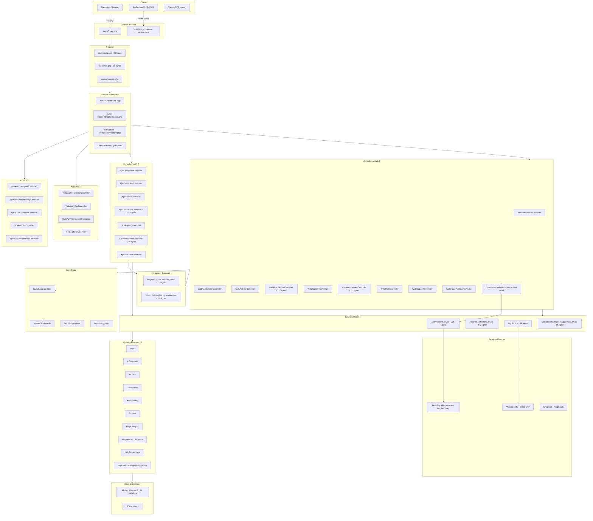

---

## 2 — Modele de Donnees ERD Complet

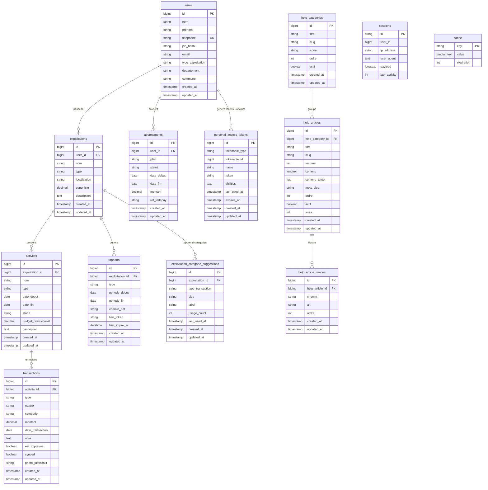

---

## 3 — Flux d Authentification Complet

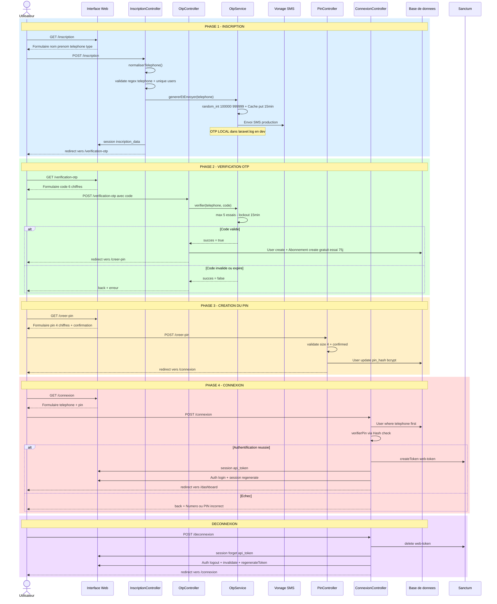

---

## 4 — Flux de Paiement FedaPay Mock et Reel

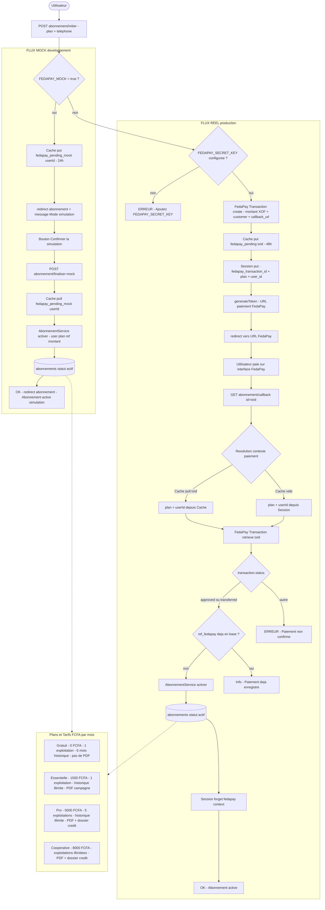

---

## 5 — Architecture des Middlewares et Routes

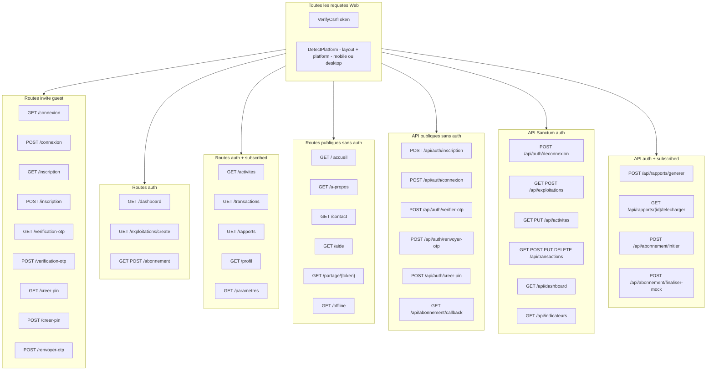

---

## 6 — Hierarchie des Controleurs

```mermaid
graph TB
    ROOT["Controllers AgroFinance+"]

    subgraph WEB_G["Web"]
        subgraph AUTH_WEB["Auth Web"]
            W1["InscriptionController - store + normaliserTelephone"]
            W2["OtpController - showForm + verify + renvoyer"]
            W3["ConnexionController - store + destroy"]
            W4["PinController - showForm + store"]
        end
        W5["DashboardController - index 161 lignes"]
        W6["ExploitationController - create + store"]
        W7["ActiviteController - index create store show cloturer abandonner"]
        W8["TransactionController - index create store edit update destroy - 317 lignes"]
        W9["RapportController - index generer telecharger partager"]
        W10["AbonnementController - index initier finaliserMock callback - 211 lignes"]
        W11["ProfilController - index + update"]
        W12["SupportController - index + rechercher + show"]
        W13["PagePubliqueController - accueil + aPropos + contact"]
    end

    subgraph API_G["API"]
        subgraph AUTH_API["Auth API"]
            A1["InscriptionController - invoke"]
            A2["VerificationOtpController - invoke + renvoyer"]
            A3["ConnexionController - invoke"]
            A4["PinController - invoke"]
            A5["DeconnexionController - invoke"]
        end
        A6["DashboardController - index"]
        A7["ExploitationController - index store show update"]
        A8["ActiviteController - index store show update cloturer abandonner"]
        A9["TransactionController - index store show update destroy batch - 196 lignes"]
        A10["RapportController - generer + telecharger"]
        A11["IndicateurController - calculer + evolution + consolidation"]
        A12["AbonnementController - initier finaliserMock callback - 246 lignes"]
    end

    subgraph SHARED["Partage"]
        T1["Concerns/HandlesPdfAbonnement trait"]
        T2["refuseSiPasGenerationRapport"]
        T3["refuseSiPasTelechargementRapport"]
    end

    ROOT --> WEB_G
    ROOT --> API_G
    ROOT --> SHARED
    W9 --> T1
    A10 --> T1
    T1 --> T2
    T1 --> T3
```

---

## 7 — Structure des Vues Blade et Layouts

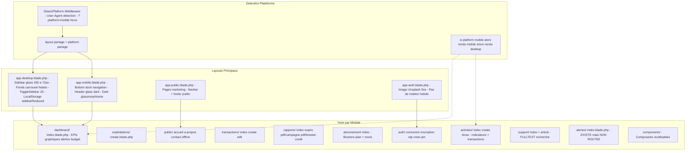

---

## 8 — Architecture PWA Service Worker et Strategies Cache

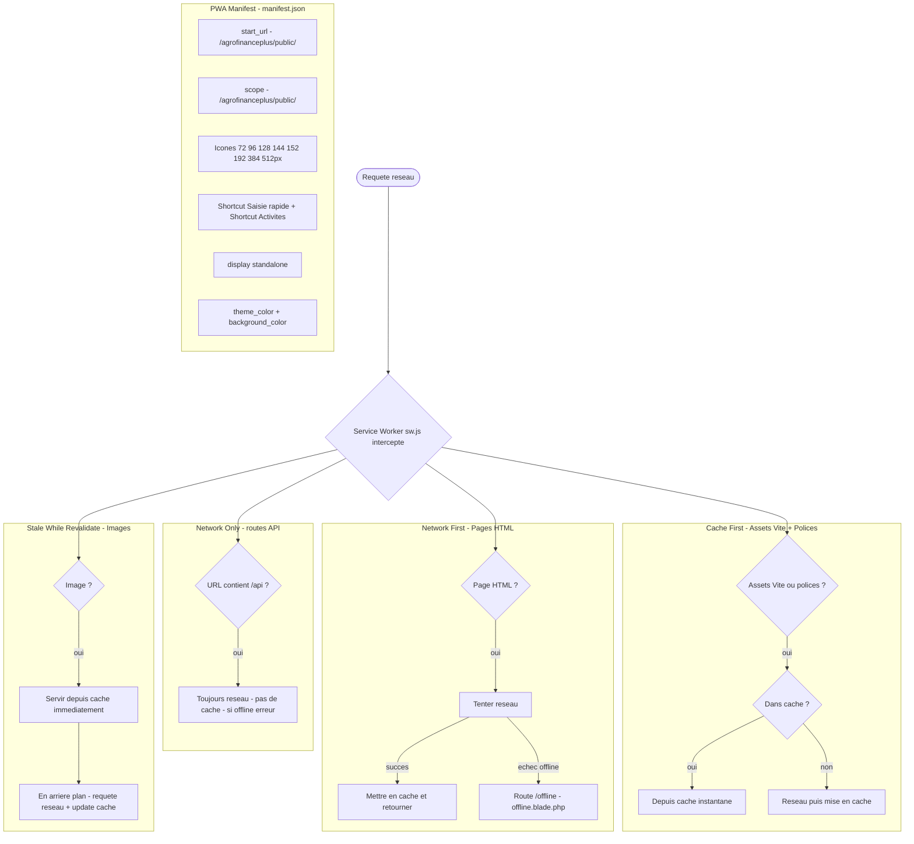

---

## 9 — Dependances et Services Externes

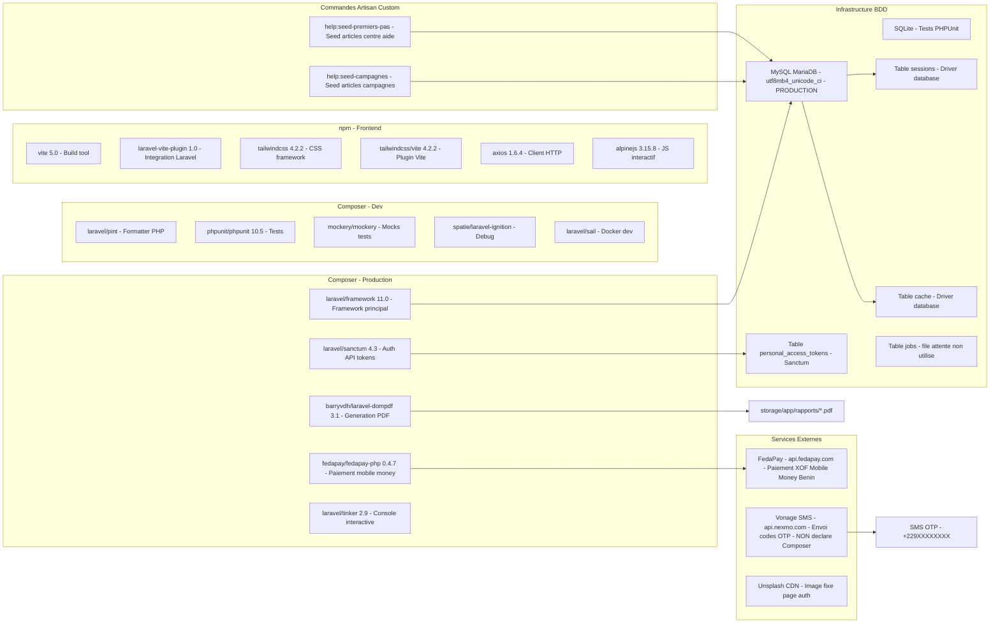

---

## Metriques Cles

| Indicateur | Valeur |
|---|---|
| **Modeles Eloquent** | 10 — User, Exploitation, Activite, Transaction, Abonnement, Rapport, HelpCategory, HelpArticle, HelpArticleImage, ExploitationCategorieSuggestion |
| **Controleurs** | 16 — 7 API + 4 Auth API + 5 Web + 4 Auth Web + 1 trait partage |
| **Services** | 4 — AbonnementService, FinancialIndicatorsService, OtpService, ExploitationCategorieSuggestionService |
| **Migrations** | 21 fichiers |
| **Routes Web** | ~35 routes nommees |
| **Routes API** | ~25 routes |
| **Layouts Blade** | 4 — desktop, mobile, public, auth |
| **Modules fonctionnels** | 10 — Dashboard, Exploitations, Activites, Transactions, Rapports, Abonnement, Aide, Marketing, Profil, PWA |
| **Services externes** | 3 — FedaPay, Vonage, Unsplash |
| **Plans abonnement** | 4 — Gratuit 0 FCFA / Essentielle 1 500 FCFA / Pro 5 000 FCFA / Cooperative 8 000 FCFA par mois |
| **Taille estimee** | ~4 500 lignes de code metier PHP |

---
# AgroFinance+ — Diagramme Systeme Complet

```mermaid
graph TB

    %% ─────────────────────────────────────────────
    %% COUCHE CLIENTS
    %% ─────────────────────────────────────────────
    subgraph CLIENTS["CLIENTS"]
        C_DESK["Navigateur Desktop"]
        C_MOB["Mobile PWA"]
        C_API["Client API Postman"]
    end

    %% ─────────────────────────────────────────────
    %% POINTS D ENTREE
    %% ─────────────────────────────────────────────
    subgraph ENTRY["ENTREE"]
        E_INDEX["public/index.php"]
        E_SW["public/sw.js\nService Worker"]
    end

    %% ─────────────────────────────────────────────
    %% MIDDLEWARES
    %% ─────────────────────────────────────────────
    subgraph MW["MIDDLEWARES"]
        MW1["DetectPlatform\nglobal web"]
        MW2["auth\nAuthenticate"]
        MW3["guest\nRedirectIfAuthenticated"]
        MW4["subscribed\nVerifierAbonnement"]
    end

    %% ─────────────────────────────────────────────
    %% ROUTES
    %% ─────────────────────────────────────────────
    subgraph ROUTING["ROUTES"]
        subgraph RWEB["routes/web.php"]
            RW1["Publiques\n/ accueil contact aide\n/partage/token offline"]
            RW2["guest\n/connexion /inscription\n/verification-otp /creer-pin"]
            RW3["auth\n/dashboard /abonnement\n/exploitations/create"]
            RW4["auth + subscribed\n/activites /transactions\n/rapports /profil /parametres"]
        end
        subgraph RAPI["routes/api.php"]
            RA1["API publiques\n/api/auth/inscription\n/api/auth/connexion\n/api/auth/verifier-otp\n/api/auth/creer-pin\n/api/abonnement/callback"]
            RA2["API auth Sanctum\n/api/exploitations\n/api/activites\n/api/transactions\n/api/dashboard\n/api/indicateurs\n/api/auth/deconnexion"]
            RA3["API auth + subscribed\n/api/rapports/generer\n/api/rapports/telecharger\n/api/abonnement/initier\n/api/abonnement/finaliser-mock"]
        end
    end

    %% ─────────────────────────────────────────────
    %% CONTROLEURS AUTH
    %% ─────────────────────────────────────────────
    subgraph CTRL_AUTH["CONTROLEURS AUTH"]
        subgraph CWAUTH["Auth Web"]
            CWA1["InscriptionController\nstore + normaliserTelephone"]
            CWA2["OtpController\nshowForm + verify + renvoyer"]
            CWA3["ConnexionController\nstore + destroy"]
            CWA4["PinController\nshowForm + store"]
        end
        subgraph CAAUTH["Auth API"]
            CAA1["Inscription invoke"]
            CAA2["VerificationOtp invoke + renvoyer"]
            CAA3["Connexion invoke"]
            CAA4["Pin invoke"]
            CAA5["Deconnexion invoke"]
        end
    end

    %% ─────────────────────────────────────────────
    %% CONTROLEURS METIER WEB
    %% ─────────────────────────────────────────────
    subgraph CTRL_WEB["CONTROLEURS WEB"]
        CW1["DashboardController\nindex 161 lignes"]
        CW2["ExploitationController\ncreate + store"]
        CW3["ActiviteController\nindex create store\nshow cloturer abandonner"]
        CW4["TransactionController\nindex create store\nedit update destroy\n317 lignes"]
        CW5["RapportController\nindex generer\ntelecharger partager"]
        CW6["AbonnementController\nindex initier\nfinaliserMock callback\n211 lignes"]
        CW7["ProfilController\nindex + update"]
        CW8["SupportController\nindex rechercher show"]
        CW9["PagePubliqueController\naccueil aPropos contact"]
        TRAIT["HandlesPdfAbonnement\ntrait partage"]
    end

    %% ─────────────────────────────────────────────
    %% CONTROLEURS METIER API
    %% ─────────────────────────────────────────────
    subgraph CTRL_API["CONTROLEURS API"]
        CA1["DashboardController\nindex"]
        CA2["ExploitationController\nindex store show update"]
        CA3["ActiviteController\nindex store show update\ncloturer abandonner"]
        CA4["TransactionController\nindex store show update\ndestroy batch\n196 lignes"]
        CA5["RapportController\ngenerer + telecharger"]
        CA6["AbonnementController\ninitier finaliserMock\ncallback\n246 lignes"]
        CA7["IndicateurController\ncalculer evolution consolidation"]
    end

    %% ─────────────────────────────────────────────
    %% SERVICES
    %% ─────────────────────────────────────────────
    subgraph SERVICES["SERVICES METIER"]
        S1["AbonnementService\nplans quotas FedaPay\n225 lignes"]
        S2["FinancialIndicatorsService\nPB CV CF CT CI\nVAB MB RNE RF SR\n172 lignes"]
        S3["OtpService\ngeneration verification\nSMS Vonage\n89 lignes"]
        S4["ExploitationCategorieSuggestionService\napprentissage categories\n85 lignes"]
        H1["TransactionCategories\ncategories par type\n179 lignes"]
        H2["WeeklyBackgroundImages\nfonds ecran hebdo\n119 lignes"]
    end

    %% ─────────────────────────────────────────────
    %% MODELES ELOQUENT
    %% ─────────────────────────────────────────────
    subgraph MODELS["MODELES ELOQUENT"]
        subgraph MOD_METIER["Domaine Metier"]
            M1["User\ntelephone PK\npin_hash bcrypt\ntype_exploitation"]
            M2["Exploitation\nuser_id FK\nnom type localisation superficie"]
            M3["Activite\nexploitation_id FK\nstatut en_cours termine abandonne\nbudget_previsionnel"]
            M4["Transaction\nactivite_id FK\ntype depense recette\nnature fixe variable\ncategorie montant date"]
            M5["Abonnement\nuser_id FK\nplan gratuit essentielle pro cooperative\nstatut actif essai expire\nref_fedapay"]
            M6["Rapport\nexploitation_id FK\ntype campagne dossier_credit\nlien_token lien_expire_le\nchemin_pdf"]
        end
        subgraph MOD_AIDE["Module Aide"]
            M7["HelpCategory\ntitre slug icone ordre actif"]
            M8["HelpArticle\ntitre slug contenu\ncontenu_texte FULLTEXT\nmots_cles vues\n154 lignes"]
            M9["HelpArticleImage\nchemin alt ordre"]
        end
        subgraph MOD_SYS["Systeme"]
            M10["ExploitationCategorieSuggestion\nslug label usage_count\nlast_used_at"]
            M11["personal_access_tokens\nSanctum web-token pwa-token"]
            M12["sessions driver database"]
            M13["cache driver database"]
        end
    end

    %% ─────────────────────────────────────────────
    %% VUES BLADE
    %% ─────────────────────────────────────────────
    subgraph VIEWS["VUES BLADE"]
        subgraph LAYOUTS["Layouts"]
            L1["app-desktop\nSidebar glass 260 a 72px\nCarrousel hebdo\nToggleSidebar localStorage"]
            L2["app-mobile\nBottom dock\nHeader glass\nDark glassmorphisme"]
            L3["app-public\nPages marketing\nNavbar + footer"]
            L4["app-auth\nImage Unsplash fixe"]
        end
        subgraph VMOD["Modules de vues"]
            V1["dashboard/index\nKPIs graphiques alertes"]
            V2["activites/index create show"]
            V3["transactions/index create edit"]
            V4["rapports/index expire\npdf/campagne pdf/dossier-credit"]
            V5["abonnement/index\nBoutons plan + mock"]
            V6["auth/connexion inscription\notp creer-pin"]
            V7["public/accueil contact\na-propos offline"]
            V8["support/index article\nFULLTEXT recherche"]
            V9["alertes/index\nEXISTE NON ROUTEE"]
        end
    end

    %% ─────────────────────────────────────────────
    %% BASE DE DONNEES
    %% ─────────────────────────────────────────────
    subgraph DB["BASE DE DONNEES"]
        DB1[("MySQL MariaDB\nutf8mb4_unicode_ci\n21 migrations\nPRODUCTION")]
        DB2[("SQLite\nTests PHPUnit")]
    end

    %% ─────────────────────────────────────────────
    %% SERVICES EXTERNES
    %% ─────────────────────────────────────────────
    subgraph EXT["SERVICES EXTERNES"]
        EX1["FedaPay\napi.fedapay.com\npaiement XOF Benin"]
        EX2["Vonage SMS\napi.nexmo.com\ncodes OTP\nNON declare Composer"]
        EX3["Unsplash CDN\nimage auth fixe"]
    end

    %% ─────────────────────────────────────────────
    %% CONNEXIONS CLIENTS → ENTREE
    %% ─────────────────────────────────────────────
    C_DESK -->|HTTPS| E_INDEX
    C_API -->|HTTPS| E_INDEX
    C_MOB -->|HTTPS| E_INDEX
    C_MOB -->|Cache offline| E_SW

    %% ─────────────────────────────────────────────
    %% ENTREE → MIDDLEWARES → ROUTES
    %% ─────────────────────────────────────────────
    E_INDEX --> MW1
    MW1 --> ROUTING
    MW1 --> MW2
    MW1 --> MW3
    MW1 --> MW4

    %% ─────────────────────────────────────────────
    %% ROUTES → CONTROLEURS
    %% ─────────────────────────────────────────────
    RW1 --> CW9
    RW2 --> CWAUTH
    RW3 --> CW1
    RW3 --> CW2
    RW3 --> CW6
    RW4 --> CW3
    RW4 --> CW4
    RW4 --> CW5
    RW4 --> CW7
    RW4 --> CW8
    RA1 --> CAAUTH
    RA2 --> CA1
    RA2 --> CA2
    RA2 --> CA3
    RA2 --> CA4
    RA2 --> CA7
    RA3 --> CA5
    RA3 --> CA6

    %% ─────────────────────────────────────────────
    %% CONTROLEURS → SERVICES
    %% ─────────────────────────────────────────────
    CW1 --> S1
    CW1 --> S2
    CW3 --> S1
    CW3 --> S2
    CW4 --> S4
    CW5 --> S1
    CW5 --> S2
    CW6 --> S1
    CWA1 --> S3
    CWA2 --> S3
    CA1 --> S1
    CA1 --> S2
    CA3 --> S2
    CA4 --> S1
    CA5 --> S1
    CA5 --> S2
    CA6 --> S1
    CA7 --> S2
    CAA2 --> S3
    CW5 --> TRAIT
    CA5 --> TRAIT
    TRAIT --> S1

    %% ─────────────────────────────────────────────
    %% CONTROLEURS → HELPERS
    %% ─────────────────────────────────────────────
    CW4 --> H1
    CA4 --> H1
    CW1 --> H2

    %% ─────────────────────────────────────────────
    %% SERVICES → MODELES
    %% ─────────────────────────────────────────────
    S1 --> M5
    S1 --> M2
    S2 --> M3
    S2 --> M4
    S3 --> M13
    S4 --> M10

    %% ─────────────────────────────────────────────
    %% MODELES → BDD
    %% ─────────────────────────────────────────────
    M1 --> DB1
    M2 --> DB1
    M3 --> DB1
    M4 --> DB1
    M5 --> DB1
    M6 --> DB1
    M7 --> DB1
    M8 --> DB1
    M9 --> DB1
    M10 --> DB1
    M11 --> DB1
    M12 --> DB1
    M13 --> DB1

    %% ─────────────────────────────────────────────
    %% RELATIONS ENTRE MODELES
    %% ─────────────────────────────────────────────
    M1 -->|1 N| M2
    M1 -->|1 N| M5
    M1 -->|1 N| M11
    M2 -->|1 N| M3
    M2 -->|1 N| M6
    M2 -->|1 N| M10
    M3 -->|1 N| M4
    M7 -->|1 N| M8
    M8 -->|1 N| M9

    %% ─────────────────────────────────────────────
    %% CONTROLEURS → VUES
    %% ─────────────────────────────────────────────
    CW1 --> V1
    CW3 --> V2
    CW4 --> V3
    CW5 --> V4
    CW6 --> V5
    CWAUTH --> V6
    CW9 --> V7
    CW8 --> V8

    %% ─────────────────────────────────────────────
    %% VUES → LAYOUTS
    %% ─────────────────────────────────────────────
    V1 --> L1
    V1 --> L2
    V2 --> L1
    V2 --> L2
    V6 --> L4
    V7 --> L3

    %% ─────────────────────────────────────────────
    %% SERVICES → EXTERNES
    %% ─────────────────────────────────────────────
    S1 -->|paiement XOF| EX1
    S3 -->|SMS OTP| EX2
    L4 -->|image fixe| EX3

    %% ─────────────────────────────────────────────
    %% TEST
    %% ─────────────────────────────────────────────
    M1 -.->|tests PHPUnit| DB2
```


